# Exercise Result Check Guide

This document is intended as a check guide for students. It gives reference plots, numerical values, input data, and hints, but it deliberately does not include the full model implementation. Use it after building your own model to check whether your result is in the right range and whether the trends make physical sense.

The figures and printed values in this document are extracted from the current solution notebooks. If a plot in your notebook looks qualitatively different, first check units, boundary conditions, array ordering, and whether the same parameter values were used. When several values for the same symbol are listed, they belong to different subquestions or parameter studies in that exercise.

## How to Use This Guide

1. Reproduce the input data listed for the exercise.
2. Compare the shape and scale of your plots with the reference figures.
3. Compare scalar values only to the shown precision; small differences can come from grid size, tolerances, or time-step choices.
4. For open-ended questions, focus on the reasoning and trends as much as the exact numerical value.

## First order reaction in a batch reactor

**Input data**

- `k = 1.0`
- `c0 = 1.0`
- `t_end = 5.0`
- `dt = 0.2`

**Numerical checks**

Code block 2:

```text
Max error: 1.80e-07
```

**Reference figures**

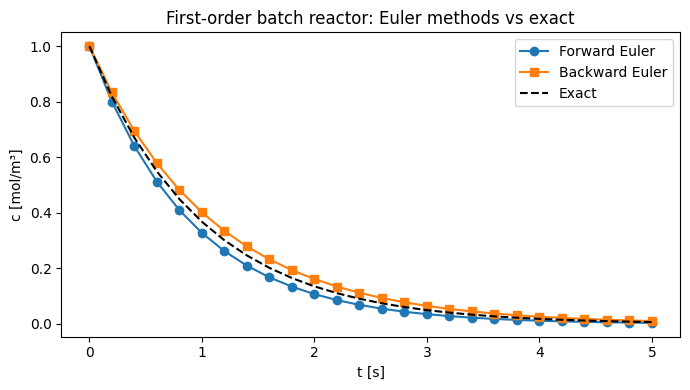

## Equilibrium consecutive batch reactions

**Input data**

- `k1 = 2.0`
- `k_1 = 1.0`
- `k2 = 3.0`
- `c0 = np.array([1.0, 0.0, 0.0])`
- `t_end = 2.0`
- `dt = 0.1`
- `k1 = 2000000000000.0`
- `k_1 = 1000000000000.0`
- `dt = 0.01`
- `nc = 3`
- `k1 = 2000000000.0`
- `k_1 = 1000000000.0`
- `c0 = [1.0, 0.0, 0.0]`

**Reference figures**

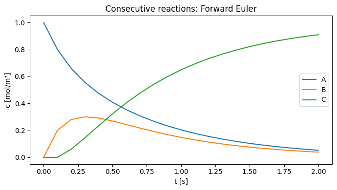

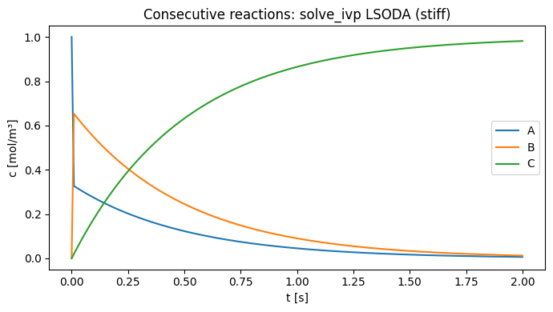

## Multicomponent convection-reaction with first-order chemical kinetics

**Input data**

- `k1 = 3.0`
- `k_1 = 2.0`
- `k2 = 1.0`
- `c0 = np.array([0.0, 0.0, 1.0])`
- `cin = np.array([1.0, 0.0, 0.0])`
- `vel = 0.3`
- `t_end = 3.0`
- `dt = 0.001`
- `L = 1.0`
- `N = 200`
- `nc = 3`
- `length = 1.0`
- `n_x = 120`
- `n_c = 3`
- `velocity = 0.3`
- `dt = 0.01`

**Reference figures**

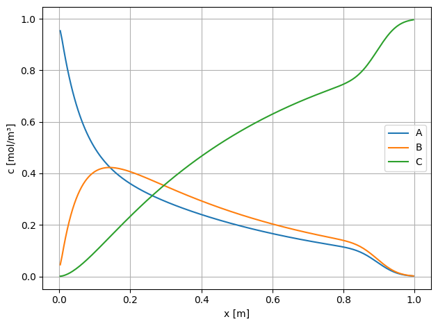

**Hints and interpretation**

The inlet is pure A, while the initial column contains C. After three seconds the inlet front has passed through the bed and the solution is close to the steady plug-flow profile. A is consumed rapidly near the inlet because the Damkohler number $k_1L/v=10$ is large. B appears as an intermediate and then decays to C, so its concentration peaks inside the reactor rather than at the outlet.

The printed conservation range verifies that the finite-volume transport and stoichiometric source preserve $A+B+C$ to roundoff. The remaining profile shape is therefore chemical, not a numerical mass leak.

## Multicomponent convection-reaction with general chemical kinetics

**Input data**

- `k1 = 3.0`
- `k_1 = 2.0`
- `k2 = 1.0`
- `c0 = np.array([0.0, 0.0, 1.0])`
- `cin = np.array([1.0, 0.0, 0.0])`
- `vel = 0.3`
- `t_end = 3.0`
- `dt = 0.001`
- `L = 1.0`
- `N = 200`
- `nc = 3`
- `cA = 1.0`
- `cB = 3.0`
- `t_end = 30.0`
- `dt = 0.01`
- `nc = 2`
- `cin_XY = np.array([0.0, 0.0])`
- `length = 1.0`
- `n_x = 120`
- `velocity = 0.3`

**Reference figures**

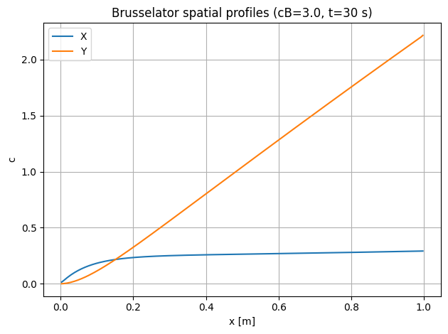

**Hints and interpretation**

The first plot matches the first-order exercise but is now solved with the same global Newton pattern used for genuinely nonlinear models. This is the useful teaching transition: replacing a per-cell `scipy.optimize.root` loop by one sparse residual keeps transport, boundary conditions, and reaction coupling in one place.

The Brusselator case is not a diffusion-driven Turing model; with convection only it is better interpreted as an open-flow autocatalytic reactor. The inlet continuously feeds a low X/Y state. Downstream, autocatalysis amplifies X and Y toward the local kinetic attractor, giving a strong spatial change over one residence time. The parameter $B=3>1+A^2$ is in the oscillatory regime of the well-mixed Brusselator, so the profile is sensitive to residence time and inlet forcing.

## Steady state 1D fixed bed reactor model: first order exothermal reaction

**Input data**

- `variable_velocity = False`
- `length = 0.8`
- `n_z = 100`
- `velocity = 0.25`
- `pressure = 101325.0`
- `T_in = 500.0`
- `R_gas = 8.314`
- `k0 = 300.0`
- `E_act = 35000.0`
- `dh_rxn = -4000.0`
- `cp = np.array([50.0, 30.0, 20.0])`

**Numerical checks**

Code block 3:

```text
Constant-pressure outlet velocity: 6.048 m/s
Constant-velocity outlet temperature: 443.00 K
Constant-pressure outlet temperature: 443.00 K
```

**Reference figures**

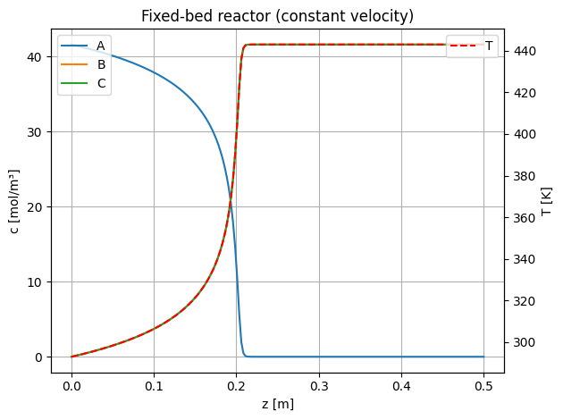

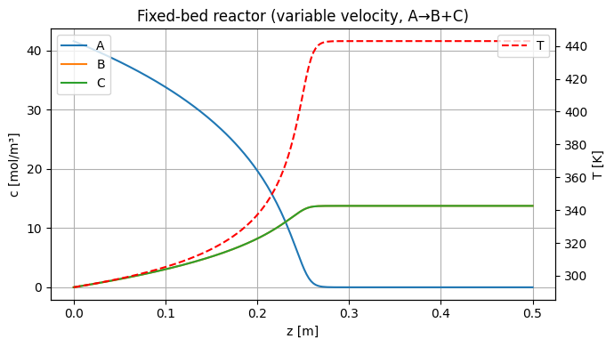

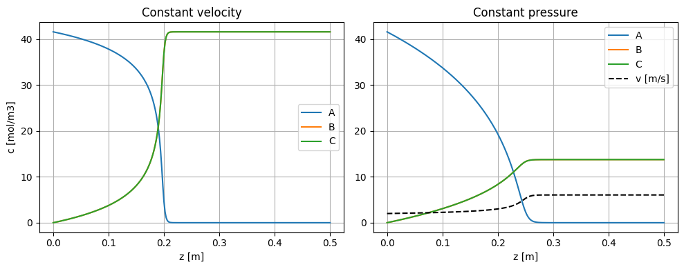

**Hints and interpretation**

The constant-velocity model and the molar-flow model use the same chemistry and heat release. The variable-velocity case gives a lower concentration of A because the mole expansion and temperature rise increase the volumetric flow. The temperature increase is in the expected adiabatic range: heat release raises the gas temperature by tens of kelvin, not hundreds, for the chosen $\Delta H_r$ and heat-capacity flow.

A useful check is that B and C remain identical everywhere, as required by the stoichiometry $A\rightarrow B+C$. The finite-volume form also makes the inlet and outlet assumptions explicit through the `pymrm` boundary dictionaries.

## Convection of one species using different schemes

**Input data**

- `c0 = 0.0`
- `cin = 1.0`
- `vel = 0.01`
- `t_end = 120.0`
- `L = 1.0`
- `N = 200`

**Numerical checks**

Code block 1:

```text
Convective timescale ratio v/dx = 2.0000 1/s
```

**Reference figures**

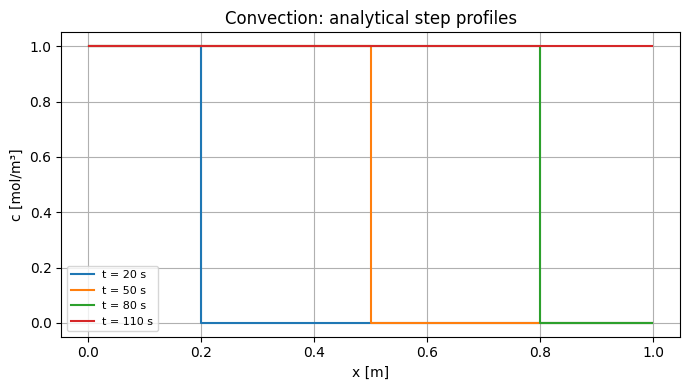

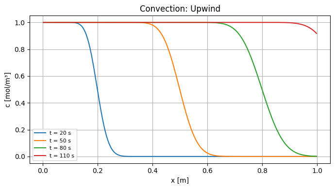

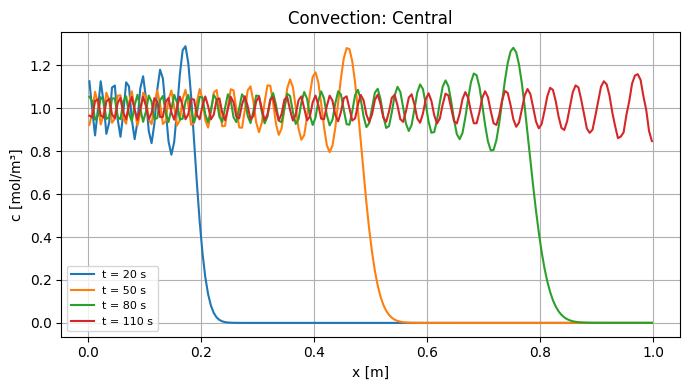

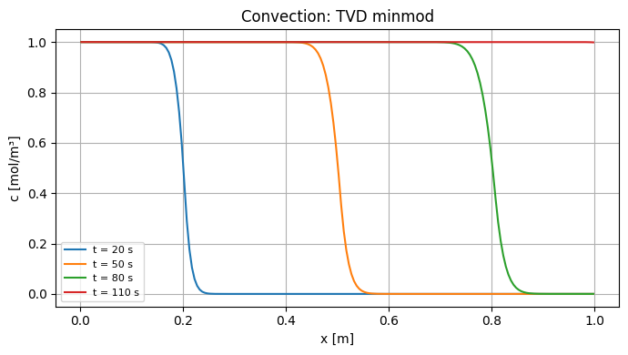

## Solving a one-component 1D diffusion-reaction equation

**Input data**

- `D = 1.0`
- `L = 1.0`
- `N = 50`
- `k = 1.0`
- `dt = 0.02`
- `t_end = 2.0`

**Numerical checks**

Code block 3:

```text
Maximum difference from steady state after 2 s: 1.110e-03
```

**Reference figures**

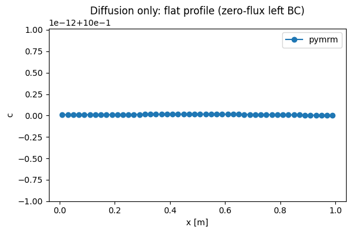

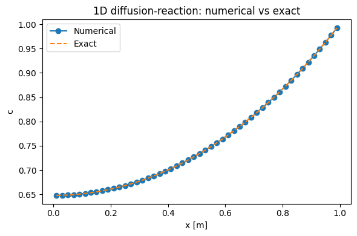

## Multi-component 1D counter-diffusion with reaction

**Input data**

- `D = np.array([1e-05, 2e-05, 1e-05, 1e-05])`
- `k1 = 1000000.0`
- `k2 = 0.0`
- `L = 0.01`
- `N = 100`
- `nc = 4`
- `D = [[1e-05, 2e-05, 1e-05, 1e-05]]`
- `rates = [100.0, 10000.0, 1000000.0]`

**Reference figures**

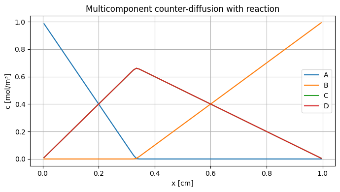

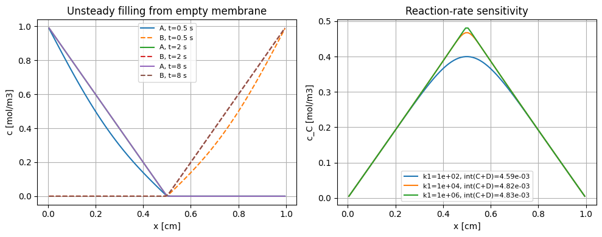

## Multi-component 1D counter-current convection with reaction

**Input data**

- `nc = 4`
- `N = 100`
- `k1 = 1.0`
- `k2 = 0.0`
- `dt = 0.1`
- `L = 1.0`
- `v = [[1, -1, 1, -1]]`

**Reference figures**

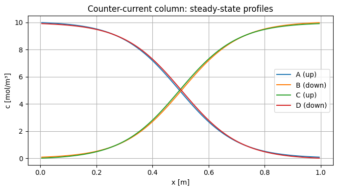

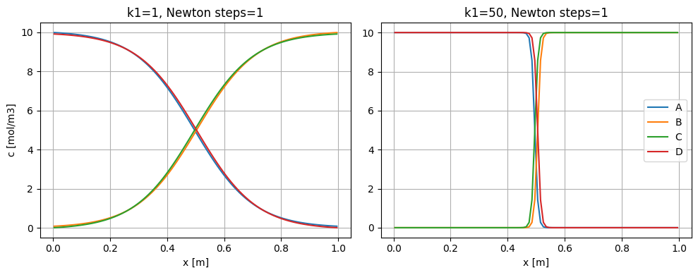

## Convection-dispersion-reaction in a 1D reactor model

**Input data**

- `D = 0.1`
- `v = 1.0`
- `k = 1.0`
- `L = 1.0`
- `N = 100`
- `dt = 0.1`
- `Dax = 0.1`
- `vel = 1.0`
- `kin = 1.0`
- `cin = 1.0`
- `length = 1.0`

**Reference figures**

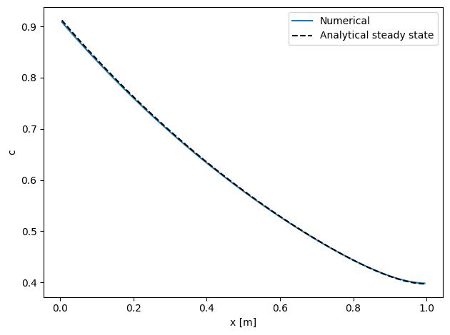

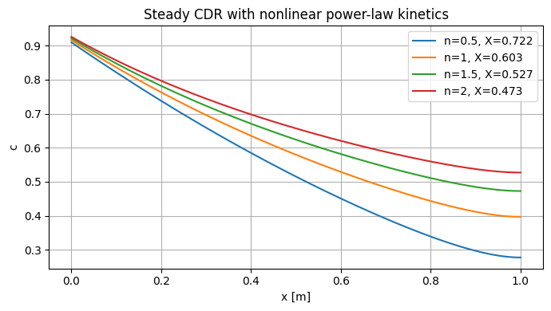

## Particle model: first order reaction

**Input data**

- `D = 1.0`
- `R = 1.0`
- `N = 50`
- `k = 1.0`
- `N = 30`
- `k = 0.0`
- `eta = []`

**Numerical checks**

Code block 1:

```text
phi = 1.00,  eta_numerical = 0.9389,  eta_exact = 0.9391
```

**Reference figures**

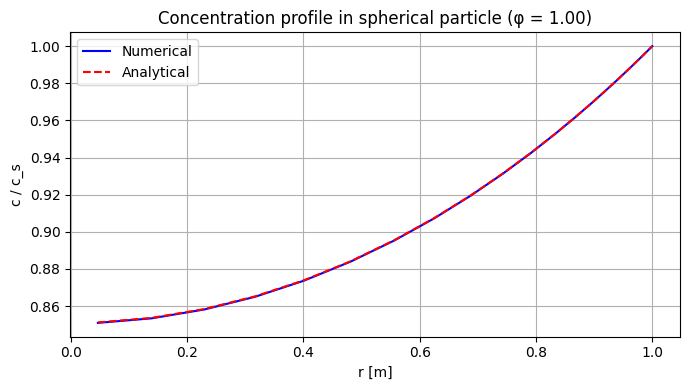

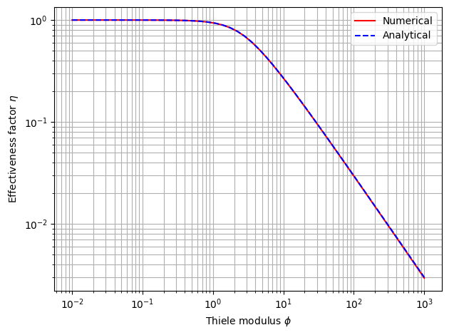

## Weisz and Hicks model

**Input data**

- `N = 30`

**Reference figures**

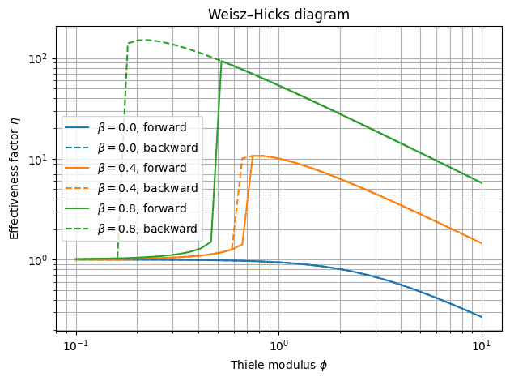

## Counter-Current Column Processes

**Input data**

- `N = 100`
- `Ug = 1.0`
- `Ul = 1.0`
- `ka = 1.0`
- `L = 1.0`
- `cg_in = 0.0`
- `cl_in = 1.0`
- `n_z = 100`
- `Ul = 0.8`
- `kLa = np.array([0.5, 0.3, 0.0, 0.0])`
- `k_rxn = 2.0`
- `L = 2.0`
- `n_c = 4`
- `cg_in = np.array([1.0, 0.0, 0.0, 0.0])`
- `cl_in = np.array([0.0, 0.0, 1.0, 0.0])`
- `labels_gas = ['A (reactant)', 'D (product)']`
- `labels_liquid = ['A (dissolved)', 'D (dissolved)', 'B (reactant)', 'C (product)']`

**Numerical checks**

Code block 2:

```text
Gas outlet    (z=L): A=0.848, D=0.290
Liquid outlet (z=0): A=0.043, D=2.443, B=0.852, C=0.148
```

**Reference figures**

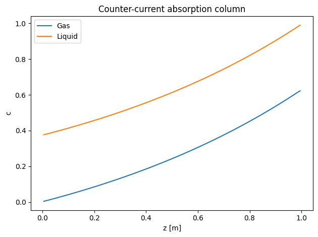

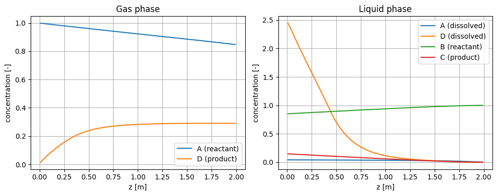

## Reactor Model for Heterogeneous Bubble Columns

**Input data and modelling choices**

The numerical values are those specified in the exercise: $\varepsilon_b=0.096$, $\varepsilon_{df}=0.135$, $\varepsilon_s=0.30$, $U_b=0.255~\mathrm{m\,s^{-1}}$, $U_{df}=0.045~\mathrm{m\,s^{-1}}$, $k_{La,b}=0.2~\mathrm{s^{-1}}$, and $k_{La,df}=1.2~\mathrm{s^{-1}}$. The distribution coefficient for the RTD is $m=3$.

The large-bubble dispersion is set to zero. The dense-bubble and slurry dispersions are numerical mixing parameters; $E_{df}=E_s=5~\mathrm{m^2\,s^{-1}}$ gives nearly well-mixed behavior without making the linear system ill-conditioned.

Key constants used in the reference run:

- `length = 10.0`
- `n_z = 120`
- `k_rxn = 0.0`
- `eps_b = 0.096`
- `eps_df = 0.135`
- `eps_s = 0.3`
- `k_l_a_b = 0.2`
- `k_l_a_df = 1.2`
- `e_b = 0.0`
- `e_df = 5.0`
- `e_s = 5.0`
- `rates = np.array([0.0, 0.01, 0.03, 0.1, 0.3, 1.0])`

**Numerical checks**

Code block 2:

```text
alpha_df = 0.122
alpha_s  = 0.782
inert large-bubble c range = 1.000000 to 1.000000
inert dense-bubble c range = 1.000000 to 1.000000
inert slurry c range       = 0.333333 to 0.333333
inert conversion           = 6.386e-13
```

Code block 3:

```text
L= 5.0 m: mean RTD from step =   3.15 s
```

Code block 3:

```text
L=15.0 m: mean RTD from step =  15.12 s
```

Code block 3:

```text
L=30.0 m: mean RTD from step =  37.50 s
```

Code block 3:

```text
k=0.03 1/s: outlet flux=0.2882, conversion=0.039
k=0.10 1/s: outlet flux=0.2640, conversion=0.120
k=0.30 1/s: outlet flux=0.2124, conversion=0.292
k=1.00 1/s: outlet flux=0.1257, conversion=0.581
```

**Reference figures**

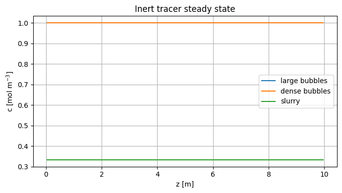

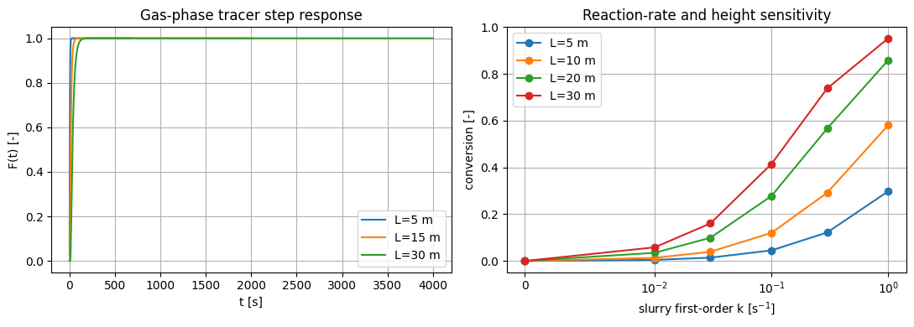

**Hints and interpretation**

The inert steady-state calculation is the strict conservation check. With $k=0$, the gas phases remain at the inlet concentration and the slurry approaches the equilibrium value $c_s=c_g/m=1/3$. The reported outlet conversion is therefore numerical roundoff, not a physical loss.

The RTD step responses reach one for every column height. The mean residence time increases with height because gas must repeatedly exchange with the well-mixed slurry holdup.

## Kunii and Levenspiel Model for a 'Fine Particle' Fluidized Bed

**Input data**

- `U = 0.08`
- `U_mf = 0.01`
- `d_b = 0.04`
- `k_rxn = 2.0`
- `length = 2.0`
- `d_gas = 0.0001`
- `eps_mf = 0.5`
- `n_z = 90`

**Numerical checks**

Code block 1:

```text
Base bubble velocity U_b = 0.515 m/s
Base bubble fraction delta = 0.136
Base outlet conversion = 0.958
Conversion range over U/U_mf sweep = 0.760 to 0.984
Conversion range over d_b sweep = 0.765 to 0.996
```

**Reference figures**

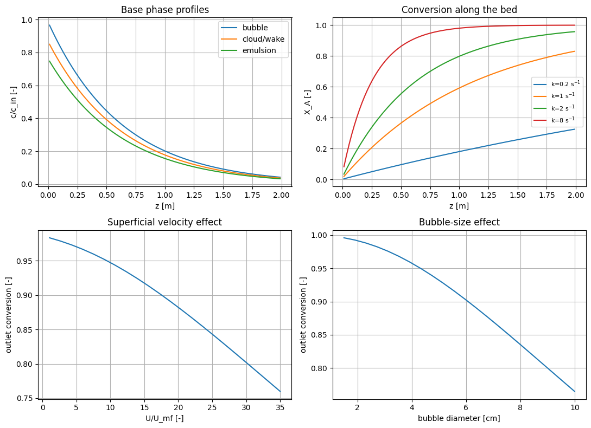

**Hints and interpretation**

The profile plot shows the expected ordering: the bubble phase has the highest concentration because it bypasses most of the catalyst, while the emulsion is most depleted. The base case is intentionally transfer-limited: $d_b=4$ cm gives finite bubble-cloud and cloud-emulsion exchange, while $k=2~\mathrm{s^{-1}}$ is fast enough that the emulsion can consume reactant faster than bubbles can replenish it.

The parameter study gives the chemically useful trends requested in the exercise:

## Computing Residence Time Distributions

**Input data**

- `v = 1.0`
- `D = 0.05`
- `L = 1.0`
- `N = 200`
- `dt = 0.01`
- `t_vec = []`
- `F_vec = []`
- `tau = 1.0`
- `eps_m = 0.65`
- `eps_s = 0.35`
- `k_ex = 2.0`
- `n_tanks = 60`

**Numerical checks**

Code block 2:

```text
Mean residence time: 1.005 s  (expected 1.000 s)
Variance: 0.1095 s²
Fitted Péclet: 18.4  (set: 20.0)
```

Code block 3:

```text
Moving/stagnant mean=1.554, variance=0.228
```

**Reference figures**

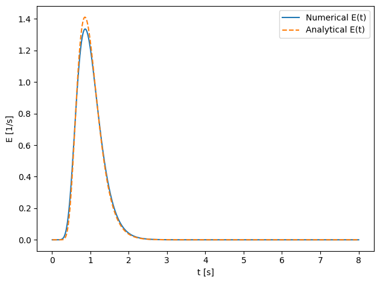

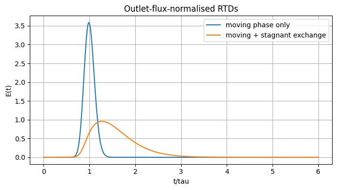

## The Westerterp Wave-Model for Axial Dispersion in Packed Beds

**Input data and modelling choices**

A step tracer input is imposed at the inlet and the cumulative RTD $F(t)$ is computed from the outlet molar flux. The dimensionless Peclet number in the exercise is $Pe=vR/D$. The aspect ratio is $L/R$.

The numerical scheme is fully implicit in time. PyMRM constructs the upwind convection, diffusion, and divergence operators. The inlet uses the Danckwerts condition for the one-phase model and the analogous flux condition for each phase in the two-phase model.

Key constants used in the reference run:

- `peclet = 50.0`
- `aspect_ratio = 100.0`
- `n_z = 100`
- `dt = 0.02`
- `radius = 0.01`
- `velocity = 0.1`

**Numerical checks**

Code block 2:

```text
Pe=50, L/R=100
CDR mean, variance      = 1.000, 0.0328
Wave mean, variance     = 1.000, 0.0327
Taylor-Aris Dax/D       = 53.1
```

**Reference figures**

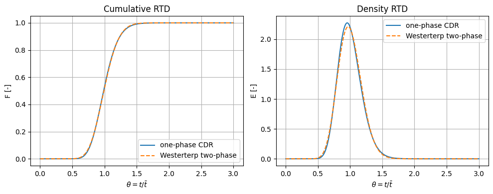

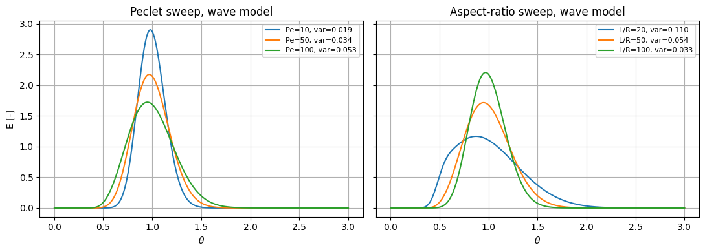

**Hints and interpretation**

Both step responses approach $F=1$, so the injected tracer leaves the reactor. The dimensionless mean is close to one for both the one-phase and two-phase descriptions, which checks the outlet-flux normalization.

The one-phase and Westerterp models have similar first two moments for the base case. Their shapes are not identical: the two-phase model has a more convective character because material travels in two velocity classes and exchanges between them.

## Modeling a Desiccant Dryer

**Input data and modelling choices**

The parameter values are those in the exercise: $v=1.5~\mathrm{m\,s^{-1}}$, $L=0.2~\mathrm{m}$, $\varepsilon=0.8$, $\rho_g=1.2~\mathrm{kg\,m^{-3}}$, $C_{p,g}=1872~\mathrm{J\,kg^{-1}\,K^{-1}}$, $\rho_s=930~\mathrm{kg\,m^{-3}}$, $C_{p,s}=1340~\mathrm{J\,kg^{-1}\,K^{-1}}$, and $f_{ds}=0.8$.

The bed is initially relatively dry and cool: $w_g=0.006$, $T=300~\mathrm{K}$. The adsorption case uses the humid inlet $w_{g,in}=0.015$, $T_{in}=307.7~\mathrm{K}$.

Key constants used in the reference run:

- `n_x = 60`
- `dt = 0.1`
- `length = 0.2`
- `velocity = 1.5`
- `eps = 0.8`
- `rho_g = 1.2`
- `cp_g = 1872.0`
- `rho_s = 930.0`
- `cp_s = 1340.0`
- `f_ds = 0.8`
- `p_total = 100000.0`

**Numerical checks**

Code block 2:

```text
outlet humidity after 90 s   = 0.01218
inlet humidity               = 0.01500
temperature range after 90 s = 307.70 to 311.78 K
loading range after 90 s     = 0.114 to 0.157 kg/kg
```

**Reference figures**

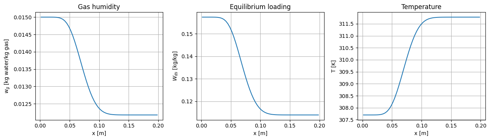

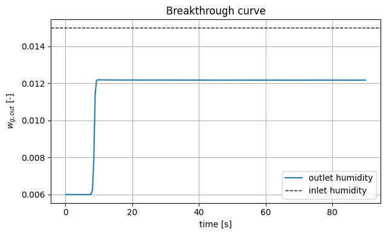

**Hints and interpretation**

The outlet humidity remains below the humid inlet after 90 s, so the bed is still adsorbing water. The temperature rises above the inlet temperature in the adsorption zone because the conserved enthalpy contains the negative sorption term; adsorption releases heat into the gas-solid matrix.

A useful numerical check is that the explicit convective update is applied to the fluxes, while the nonlinear accumulation relation is solved implicitly at every grid cell. This is the formulation requested in the exercise.

## Axial Convection with Radial Dispersion

**Input data**

- `velocity = 1.0`
- `d_radial = 0.01`
- `radius = 0.1`
- `length = 1.5`
- `n_r = 100`

**Numerical checks**

Code block 1:

```text
Outlet cup-mixing conversion: 1.000
Outlet Sherwood number: 5.765
Graetz/Nusselt asymptote for plug flow and c_wall=0: 5.783
```

Code block 2:

```text
Developed Sherwood number: 5.7646
Relative error versus 5.783: 0.32%
```

**Reference figures**

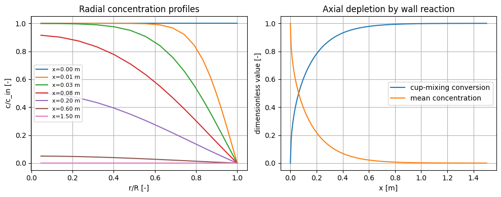

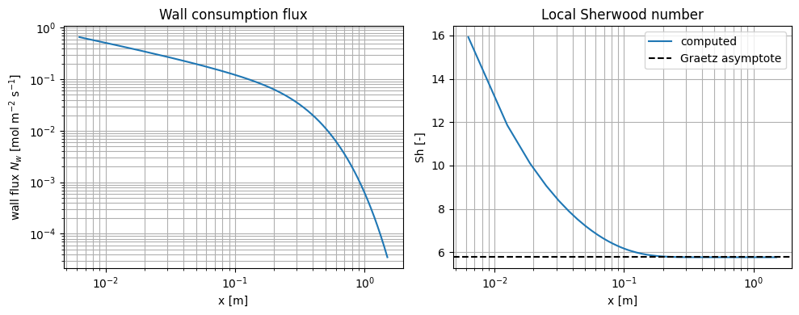

**Hints and interpretation**

This is the classical plug-flow Graetz-Nusselt limit with a constant-concentration wall. The computed Sherwood number approaches $5.783$, the first-eigenvalue result for uniform axial velocity in a circular tube with $c(R)=0$.

The radial profiles show the developing concentration boundary layer. Near the inlet only the wall region is depleted; farther downstream the wall sink has affected the whole cross-section and the profile shape approaches the first Bessel eigenfunction. The outlet conversion is therefore controlled by radial diffusion to the wall, not by a volumetric first-order rate constant.

The correct centreline boundary condition is symmetry, $\partial c/\partial r=0$. The wall boundary condition for the infinitely fast surface reaction is Dirichlet, $c(R)=0$; a finite-rate surface reaction would instead use a Robin condition, but that is a different model.

## Diffusion-Reaction in a Cylindrical Pore

**Input data**

- `D = 1e-05`
- `radius = 1e-06`
- `length = 5e-06`
- `n_z = 180`
- `n_r = 48`

**Numerical checks**

Code block 2:

```text
min(c/c0) = 2.521e-07
max(c/c0) = 0.982
area-averaged c/c0 near mouth = 0.919
area-averaged c/c0 at closed end = 8.331e-06
wall consumption rate per pore = 2.028e-10 mol/s for c0 = 1 mol/m3
inlet flux / wall consumption = 1.000000
```

**Reference figures**

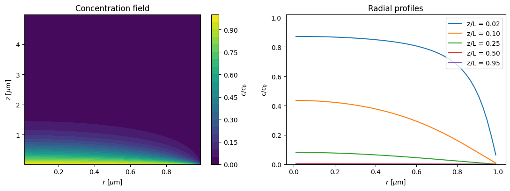

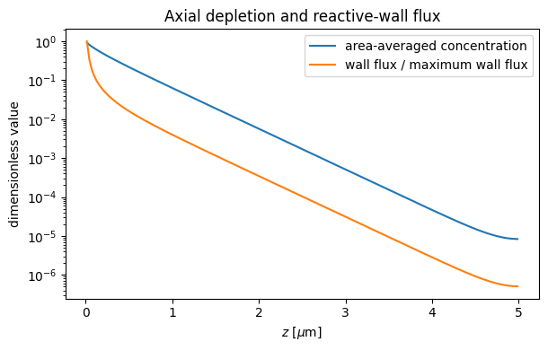

**Hints and interpretation**

The finite-volume balance closes: the inlet flux equals the integrated wall consumption to numerical precision. The zero-gradient condition at the closed end also gives zero axial flux there.

A useful physical check is the axial penetration length. With an absorbing cylindrical wall, the slowest radial eigenmode has a length scale of order $R/2.405 \approx 0.42~\mu\mathrm{m}$. Since the pore is $5~\mu\mathrm{m}$ long, most reactant is consumed close to the entrance and very little reaches the closed end. The numerical solution shows exactly this behavior.

## 2D Membrane Fixed Bed Reactor Model

**Input data and modelling choices**

The model uses the values in the exercise: $D_{e,r}=10^{-4}~\mathrm{m^2\,s^{-1}}$, $U_0=0.2~\mathrm{m\,s^{-1}}$, $R=0.02~\mathrm{m}$, $L=1.0~\mathrm{m}$, $k_f=k_b=0.1~\mathrm{m^3\,mol^{-1}\,s^{-1}}$, $c_{A,in}=c_{B,in}=10~\mathrm{mol\,m^{-3}}$, and $c_{C,in}=c_{D,in}=0$.

For the stoichiometric inlet and $K=k_f/k_b=1$, the thermodynamic equilibrium conversion is $X_{eq}=0.5$.

Key constants used in the reference run:

- `k_m = 0.0`
- `d_r = 0.0001`
- `n_r = 40`
- `n_z = 121`
- `n_c = 4`
- `radius = 0.02`
- `length = 1.0`
- `velocity = 0.2`
- `k_f = 0.1`
- `k_b = 0.1`
- `species = ['A', 'B', 'C', 'D']`
- `km_values = [0.0, 0.01, 0.1, 1.0, 10.0, 100.0]`

**Numerical checks**

Code block 2:

```text
thermodynamic equilibrium conversion = 0.500
```

Code block 2:

```text
km=     0 m/s: X_A=0.500, outlet [A,B,C,D]=5.000, 5.000, 5.000, 5.000
km=  0.01 m/s: X_A=0.698, outlet [A,B,C,D]=3.018, 3.018, 0.833, 6.982
km=   0.1 m/s: X_A=0.775, outlet [A,B,C,D]=2.251, 2.251, 0.233, 7.749
km=     1 m/s: X_A=0.784, outlet [A,B,C,D]=2.160, 2.160, 0.187, 7.840
km=    10 m/s: X_A=0.785, outlet [A,B,C,D]=2.151, 2.151, 0.182, 7.849
km=   100 m/s: X_A=0.785, outlet [A,B,C,D]=2.150, 2.150, 0.182, 7.850
```

Code block 3:

```text
D_er = 1e-04 m2/s
  km=     0: X_A=0.500, outlet C wall/center=5.000/5.000
```

Code block 3:

```text
km=  0.01: X_A=0.698, outlet C wall/center=0.578/1.091
  km=   0.1: X_A=0.775, outlet C wall/center=0.051/0.417
```

Code block 3:

```text
km=     1: X_A=0.784, outlet C wall/center=0.013/0.360
  km=    10: X_A=0.785, outlet C wall/center=0.010/0.355
```

Code block 3:

```text
km=   100: X_A=0.785, outlet C wall/center=0.010/0.354
D_er = 1e-05 m2/s
  km=     0: X_A=0.500, outlet C wall/center=5.000/5.000
```

Code block 3:

```text
km=  0.01: X_A=0.601, outlet C wall/center=0.577/4.326
  km=   0.1: X_A=0.621, outlet C wall/center=0.165/4.171
```

Code block 3:

```text
km=     1: X_A=0.623, outlet C wall/center=0.122/4.152
  km=    10: X_A=0.623, outlet C wall/center=0.118/4.151
```

Code block 3:

```text
km=   100: X_A=0.623, outlet C wall/center=0.118/4.150
```

**Reference figures**

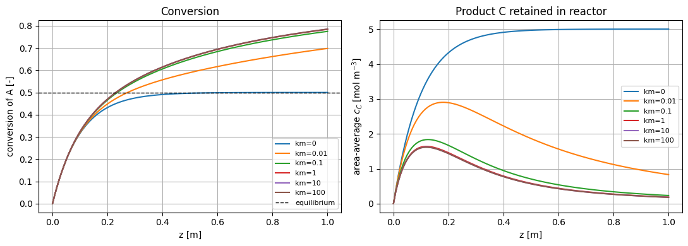

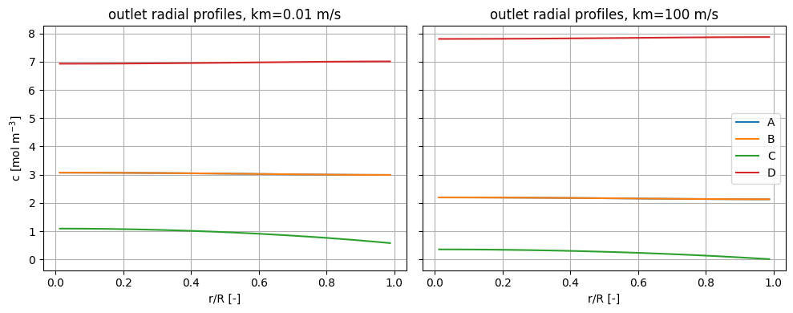

**Hints and interpretation**

For $k_m=0$, the outlet conversion approaches the thermodynamic equilibrium value $X_{eq}=0.5$ and the outlet concentrations satisfy $A\approx B\approx C\approx D\approx5~\mathrm{mol\,m^{-3}}$. This is the main check that the reversible reaction stoichiometry and signs are correct.

When $k_m>0$, only component $C$ develops a wall gradient and only $C$ is removed through the boundary condition. Component $D$ remains in the reactor, so the conversion increase is finite rather than complete.

## Steady-state 2D fixed bed reactor model: first order exothermal reaction

**Input data**

- `Dr = 8e-05`
- `lam_r = 0.25`
- `v = 0.25`
- `rho_Cp = 2500.0`
- `k0 = 200000.0`
- `Ea = 55000.0`
- `R_gas = 8.314`
- `DHr = -80000.0`
- `T_in = 520.0`
- `T_w = 500.0`
- `Uw = 250.0`
- `R_tube = 0.02`
- `L = 1.0`
- `Nr = 24`
- `Nz = 120`
- `nc = 2`

**Numerical checks**

Code block 1:

```text
Adiabatic temperature rise for full conversion: 64.0 K
Maximum centreline temperature: 533.5 K
Outlet area-average conversion: 0.854
```

Code block 2:

```text
1D adiabatic outlet temperature: 584.0 K
2D outlet area-average temperature: 503.7 K
2D outlet wall temperature: 500.8 K
```

**Reference figures**

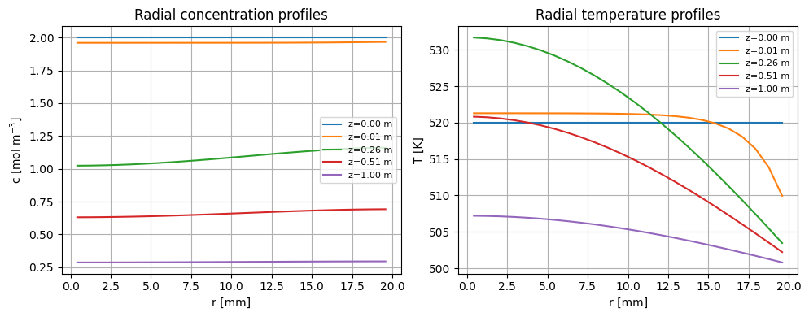

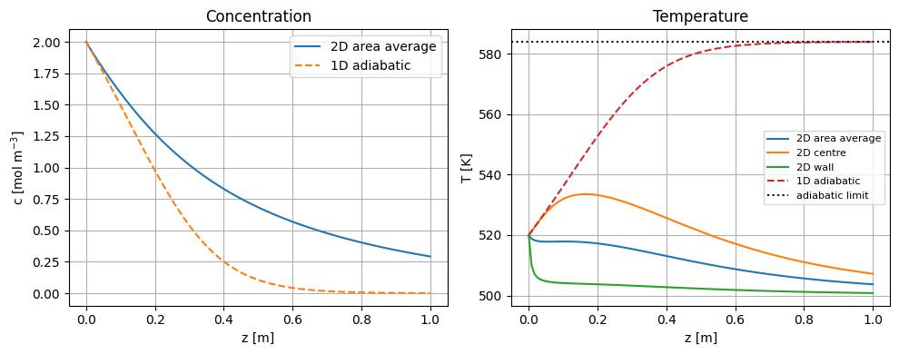

## A 2D Gas-Solid Fluidized Bed

**Input data and modelling choices**

The bed radius is $1.0~\mathrm{m}$ and the expanded bed height is $3.0~\mathrm{m}$. The model uses the parameter values from the exercise: $\langle U_0\rangle=0.50~\mathrm{m\,s^{-1}}$, $D_r=0.01~\mathrm{m^2\,s^{-1}}$, $K_{r,1}=0.080~\mathrm{s^{-1}}$, $K_{r,2}=0.010~\mathrm{s^{-1}}$, $K_{bc}=2.5~\mathrm{s^{-1}}$, $K_{ce}=1.5~\mathrm{s^{-1}}$, and $\gamma_b=0.005$, $\gamma_c=0.200$, $\gamma_e=5.000$.

The concentration array has shape `(n_r, n_c)`, with species ordered as `A, B, C`. The axial coordinate is the integration variable in a method-of-lines solve.

Key constants used in the reference run:

- `n_r = 100`
- `n_z = 200`
- `radius = 1.0`
- `length = 3.0`
- `d_r = 0.01`
- `k_r1 = 0.08`
- `k_r2 = 0.01`
- `k_ce = 1.5`
- `gamma_b = 0.005`
- `gamma_c = 0.2`
- `gamma_e = 5.0`
- `species = ['A', 'B', 'C']`
- `n_c = 3`

**Numerical checks**

Code block 1:

```text
2D radial-dispersion model
  flow-averaged outlet A, B, C = 1.1548, 2.9778, 0.8675 mol/m3
  conversion of A = 0.769047
  selectivity to B = 0.774408
Uniform plug-flow reference
  conversion of A = 0.827936
  selectivity to B = 0.788523
```

**Reference figures**

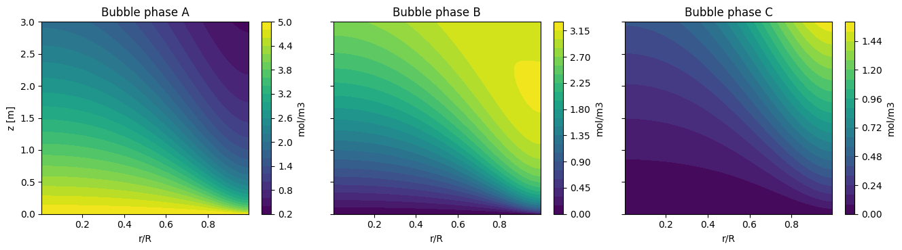

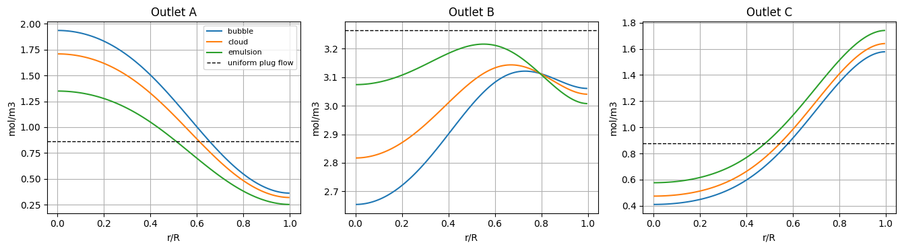

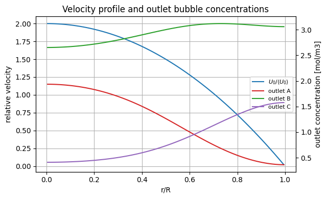

**Hints and interpretation**

The uniform-velocity/no-radial-dispersion case reproduces the old MTO tutorial answer. The computed values are

$$
X_A \approx 0.82794,\qquad S_B \approx 0.78852,
$$

matching the listed plug-flow reference values $X_A=0.827934$ and $S_B=0.788524$. This validates the phase coupling and reaction terms independently of the radial dispersion calculation.

The 2D case uses the same phase model but adds radial dispersion and the parabolic bubble velocity profile. Outlet conversion and selectivity must be based on cup-mixing averages:

$$
\langle \Phi \rangle =
\frac{\int_0^R 2\pi r U_0(r)\Phi(r)\,dr}
{\int_0^R 2\pi r U_0(r)\,dr}.
$$

## A 2D Bubble Column Model

**Input data and modelling choices**

The column data are taken from the exercise statement:

- column diameter: $D_T=19~\mathrm{cm}$
- total height: $H=190~\mathrm{cm}$
- bottom and top mixed zones: $19~\mathrm{cm}$ each
- superficial liquid velocity: $U_L=1~\mathrm{cm~s^{-1}}$
- superficial gas velocity: $U_G=10~\mathrm{cm~s^{-1}}$
- middle-section profiles:

$$
\varepsilon_G(r)=0.25-0.18\frac{r}{R},\qquad
v_L(r)=v_{L,0}\left(1-\frac{r}{0.7R}\right),
$$

$$
D_{ax}=200~\mathrm{cm^2~s^{-1}}+300~\mathrm{cm^2~s^{-1}}\frac{r}{R},
\qquad
D_{rad}=40~\mathrm{cm^2~s^{-1}}.
$$

The values of $v_{L,0}$ and $\Delta v_{GL}$ are determined from the two superficial-flow constraints:

$$
U_L=\frac{2}{R^2}\int_0^R \varepsilon_L v_L r\,dr,
\qquad
U_G=\frac{2}{R^2}\int_0^R \varepsilon_G (v_L+\Delta v_{GL}) r\,dr.
$$

Key constants used in the reference run:

- `n_z = 70`
- `n_r = 24`
- `k_l_a = 0.0`
- `equilibrium_slope = 1.0`
- `k_liq = 0.0`
- `k_gas = 0.0`
- `diameter = 0.19`
- `height = 1.9`
- `end_zone_height = 0.19`
- `d_rad_middle = 0.004`
- `d_end = 0.5`

**Numerical checks**

Code block 2:

```text
average gas holdup      = 0.130
average liquid holdup   = 0.870
v_L0                    = 0.363 m/s
Delta v_GL              = 0.712 m/s
middle liquid velocity  = -0.145 to 0.353 m/s
middle gas velocity     = 0.406 to 1.356 m/s
```

Code block 3:

```text
insoluble liquid conversion = 8.687e-12
insoluble gas conversion    = 1.632e-13
liquid concentration range  = 1.000 to 1.000
gas concentration range     = 1.000 to 1.000
```

Code block 4:

```text
liquid residence time eps_L H/U_L = 165.3 s
gas residence time eps_G H/U_G    = 2.47 s
liquid conversion at k=0.05 1/s  = 0.660
gas conversion at k=0.05 1/s     = 0.104
```

Code block 5:

```text
soluble gas conversion          = 0.306
gas concentration range         = 0.694 to 0.998 mol/m3
liquid concentration range      = 0.001 to 0.155 mol/m3
outlet centre/wall liquid c     = 0.155, 0.155 mol/m3
```

**Reference figures**

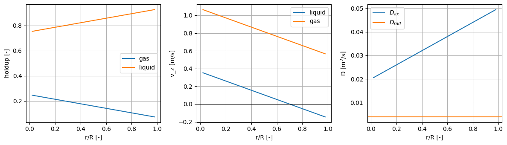

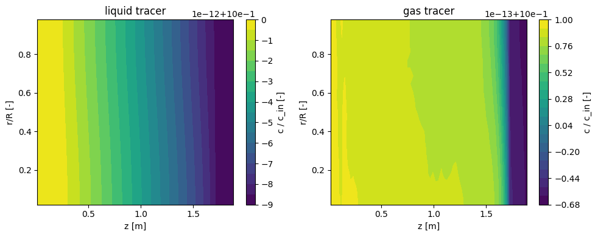

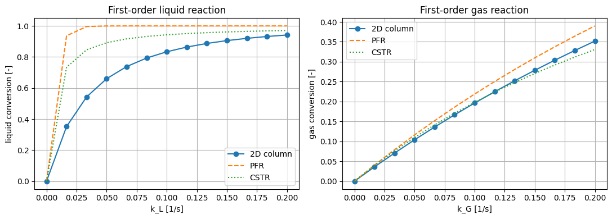

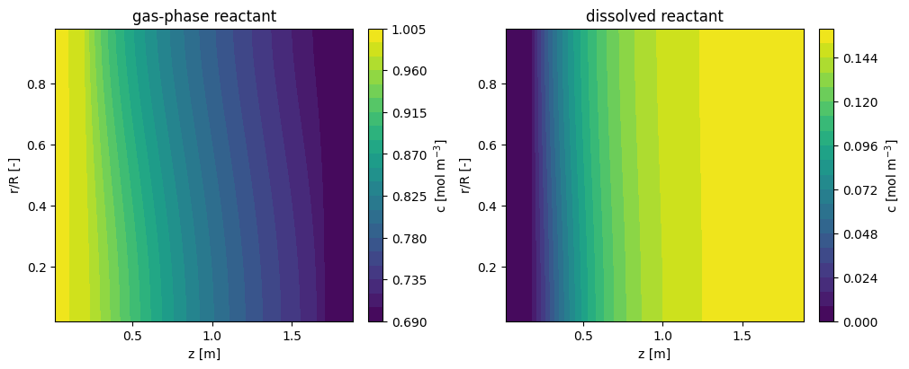

**Hints and interpretation**

The insoluble tracer is the main conservation check. With $k_La=0$ and no reaction, both phase concentrations should remain at the inlet value and the outlet conversion should be near zero. This is a strict check on the phase-continuity closure: changing the axial profile between the end zones and the middle section requires a compensating radial convective flux.

The computed values of $v_{L,0}$ and $\Delta v_{GL}$ satisfy the prescribed superficial flow constraints by construction. The middle liquid velocity is negative near the wall, which is essential: without that downflow the model does not represent the circulation pattern in the exercise.

The reaction comparisons are not expected to coincide exactly with ideal PFR or CSTR curves. The 2D column contains radial nonuniformity, recirculation, and highly diffusive end zones.

## Taylor Dispersion

**Input data and modelling choices**

The parameter set is chosen so that Taylor dispersion is visible on the length and time scale of the simulation. The radial Peclet number is about 100, which gives $D_\mathrm{T}/D_m\approx 209$. The pulse is initially placed well inside the tube rather than injected at the inlet; this avoids start-up boundary artefacts and makes the outlet signal a residence-time response for the remaining distance to the outlet.

The time step is chosen so that the Courant number based on the maximum centreline velocity remains moderate. For the implicit upwind scheme this is an accuracy and temporal-resolution choice, not a strict stability condition:

$$
\mathrm{Co}=\frac{v_\mathrm{max}\Delta t}{\Delta z}\approx 0.4.
$$

Key constants used in the reference run:

- `length = 1.0`
- `radius = 0.005`
- `d_m = 1e-06`
- `velocity = 0.02`
- `n_z = 160`
- `n_r = 28`
- `courant_target = 0.4`
- `t_end = 60.0`
- `z0 = 0.15`
- `sigma_z0 = 0.025`
- `time_check = 20.0`

**Numerical checks**

Code block 3:

```text
radial Peclet number Pe_r       = 100.0
Taylor-Aris D_T / D_m           = 209.3
radial mixing time R^2/(4D_m)   = 6.25 s
Courant number Co               = 0.400
outlet amount recovered         = 1.010
2D RTD mean and std             = 42.72 s, 7.24 s
1D Taylor-Aris mean and std     = 42.27 s, 6.33 s
```

Code block 4:

```text
at t = 20 s:
mean z, 2D / Taylor-Aris       = 0.5510 m / 0.5500 m
variance, 2D / Taylor-Aris     = 0.01130 m^2 / 0.00900 m^2
apparent axial dispersion      = 2.67e-04 m^2/s
Taylor-Aris dispersion         = 2.09e-04 m^2/s
molecular diffusivity          = 1.00e-06 m^2/s
```

**Reference figures**

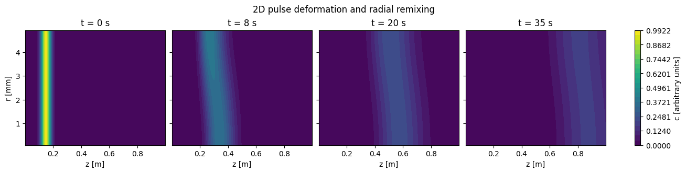

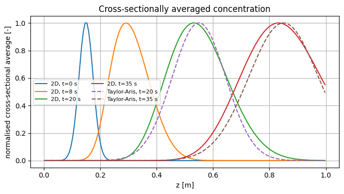

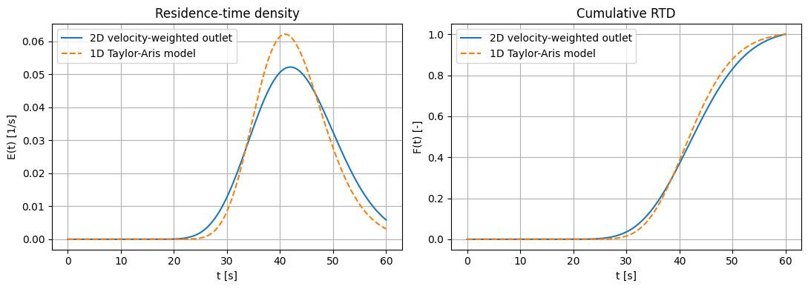

**Hints and interpretation**

Two simple checks are useful here.

First, the convection operator is included in the implicit time-step matrix. The Courant number printed above is therefore used as a temporal-resolution check. A value of about 0.4 keeps the pulse motion well resolved relative to the axial grid.

Second, before the pulse reaches the outlet, the axial mean and variance of the cross-sectionally averaged concentration can be compared with the Taylor-Aris long-time prediction:

$$
\bar{z}(t)\approx z_0+\bar{v}t,
\qquad
\sigma_z^2(t)\approx \sigma_{z,0}^2+2D_\mathrm{T}t.
$$

The variance comparison is not exact because the numerical upwind flux adds some axial numerical dispersion. The important check is that the mean moves at the imposed mean velocity and the inferred dispersion is of the same order as $D_\mathrm{T}$, not $D_m$.

## Ternary Diffusion with Maxwell-Stefan Equations

**Input data**

- `n_z = 80`
- `D_ms = np.array([[0.0, 2.1e-05, 7.3e-05], [2.1e-05, 0.0, 7e-05], [7.3e-05, 7e-05, 0.0]])`

**Hints and interpretation**

The mole-fraction profiles are mildly curved because the Maxwell-Stefan resistance matrix depends on local composition. Helium's high binary diffusivity changes the O2 and N2 fluxes through the off-diagonal terms; treating each species with an independent Fickian diffusivity would miss this coupling.

The flux panel is the validation check. The independent fluxes are constant through the domain to numerical precision, which is the steady-state conservation requirement. The chosen boundary compositions create large enough gradients to make cross-diffusion visible while keeping all mole fractions comfortably between zero and one.

## Dehydrogenation of Ethanol

**Input data**

- `R_p = 0.001`
- `k_rxn = 100.0`
- `K_eq = 0.5`
- `N = 30`
- `D_eff = np.array([3e-07, 3e-07, 1.5e-06])`
- `R_p_cmp = 0.001`
- `k_cmp = 20.0`
- `names = ['direct', 'matrix', 'linear', 'mass avg']`

**Numerical checks**

Code block 1:

```text
Wilke effective diffusivities [m²/s]:
  D_eff,1 = 4.412e-06
  D_eff,2 = 3.818e-06
  D_eff,3 = 1.371e-05
```

Code block 3:

```text
{'direct': '0.3226', 'matrix': '0.3241', 'linear': '0.3224', 'mass avg': '0.4121'}
```

**Reference figures**

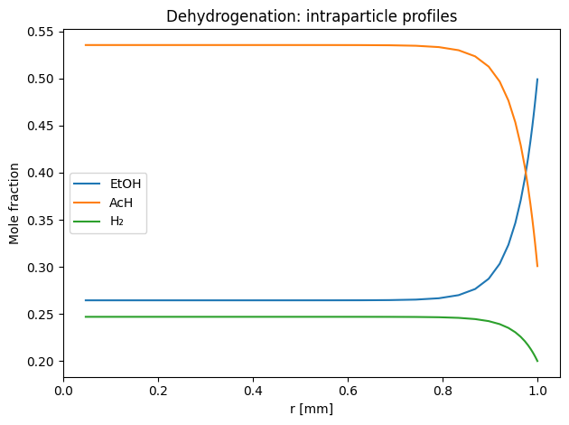

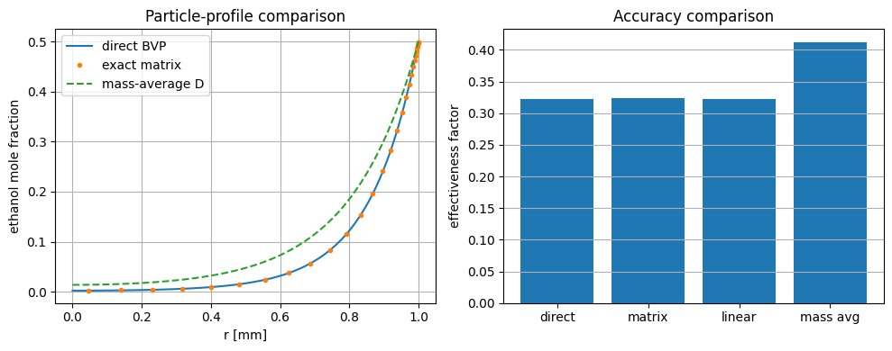

## Mass Transfer Limitations Using Maxwell-Stefan Equations

**Input data**

- `n_z = 80`
- `D_ms = np.array([[0.0, 2e-05, 2.2e-05], [2e-05, 0.0, 1.6e-05], [2.2e-05, 1.6e-05, 0.0]])`

**Hints and interpretation**

The oxygen and carbon dioxide profiles are not exactly linear because the Maxwell-Stefan matrix changes with composition. Nitrogen has no imposed boundary jump in this example, yet its profile is slightly curved through the constraint $x_1+x_2+x_3=1$ and through frictional coupling with the O2 and CO2 fluxes.

The printed flux variation is the conservation check: at steady state, each species flux should be constant through the film. The non-equimolar fluxes are large enough to create visible changes over a 100 micrometer film, which makes the multicomponent coupling clear without producing negative mole fractions.

## Coupled Batch Reactor and Particle Model

**Input data**

- `D_p = 1e-09`
- `k = 10.0`
- `R_p = 0.0001`
- `k_ext = 0.0001`
- `a_p = 6000.0`
- `t_end = 1000.0`
- `dt = 1.0`
- `N = 30`
- `t_arr = [0.0]`

**Reference figures**

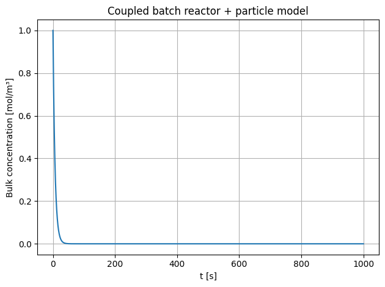

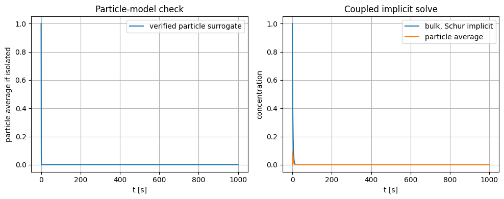

## Particle Model Coupled to Column Model

**Input data**

- `v = 0.1`
- `Dax = 0.001`
- `L = 1.0`
- `Nz = 50`
- `eps = 0.4`
- `D_p = 1e-09`
- `k = 0.5`
- `R_p = 0.0001`
- `k_ext = 0.0001`
- `Nr = 15`

**Reference figures**

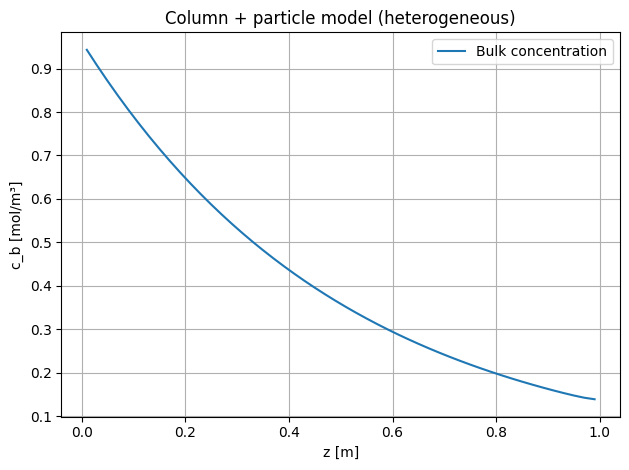

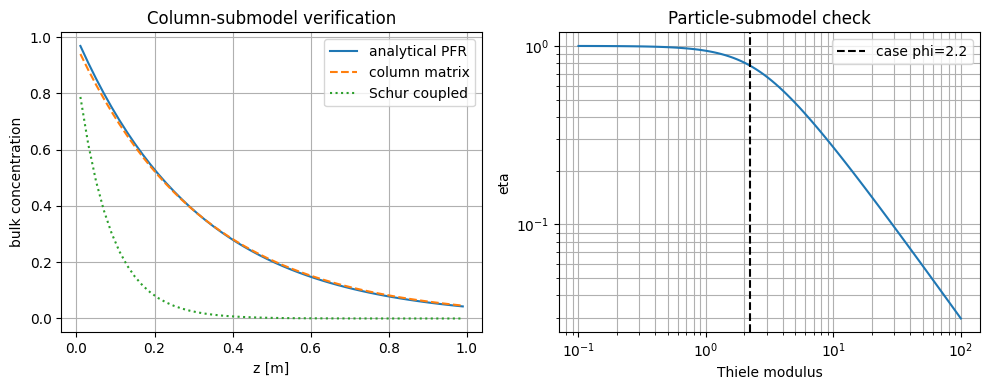

## Pressure-velocity coupling in column models

**Input data**

- `length = 2.0`
- `n_z = 100`
- `eps = 0.4`
- `d_p = 0.003`
- `mu = 2e-05`
- `R_gas = 8.314`
- `P_in = 200000.0`
- `T_in = 500.0`
- `v_in = 0.5`
- `k0 = 1000.0`
- `E_act = 35000.0`
- `dh_rxn = -8000.0`
- `cp = np.array([50.0, 30.0, 20.0])`
- `mw = np.array([0.044, 0.022, 0.002])`

**Hints and interpretation**

The model shows the expected coupling. As A reacts to two product moles, the total molar flux increases. The exothermic heat release raises the temperature, and the pressure drop lowers the total gas concentration. All three effects increase the superficial velocity downstream.

The Ergun pressure drop remains moderate for the chosen 3 mm particles and 0.5 m/s inlet velocity. This is intentional: the pressure profile is large enough to see in the plot while keeping the ideal-gas packed-bed model in a physically sensible range. The parameter choice is consistent with standard packed-bed reactor modeling practice, where Ergun hydrodynamics are coupled to plug-flow material and energy balances.
