# Exercise Result Checks

This page helps you check whether your own solution of an exercise is heading
in the right direction. It is not a set of solutions. For each exercise it gives
rounded target values or ranges, the trends and signs you should see, sanity
checks that a correct model passes, and pitfalls that often lead to wrong
results. Some exercises also show a reference figure.

How to use it:

1. Build your model with the data of the exercise first, without looking here.
2. Compare your results with the targets. Agreement within the stated rounding
   or range means you are on track; small differences can come from grid size,
   time step or solver tolerances, so refine before you worry.
3. If a result is far off, go through the sanity checks and pitfalls: units,
   the sign convention of the boundary conditions, reading outlet values at the
   boundary face rather than in the last cell, and converged solves.
4. For questions that ask you to explain or discuss, the checks name what a good
   answer involves; the reasoning is yours to write.

## First order reaction in a batch reactor

:::{admonition} Check: question 1
:class: tip
- With $k = 1~\mathrm{s^{-1}}$ and $\Delta t = 0.2$ s, each step multiplies $c$ by about 0.80, while the exact solution decays by about 0.82 per 0.2 s.
- Halving $\Delta t$ should roughly halve the error at a fixed time: the scheme is first order.
- Try a few larger steps ($k\Delta t$ above 1 and above 2) and look at the sign and size of $c$; a decaying first-order reaction must never give negative or growing concentrations.
:::

:::{admonition} Check: question 2
:class: tip
- With $k\Delta t = 0.2$, each step multiplies $c$ by about 0.83.
- Halving $\Delta t$ should roughly halve the error at a fixed time.
- Sanity check: with a very large step (for example $k\Delta t = 5$) the solution must still decay monotonically, without oscillations.
:::

:::{admonition} Check: question 3
:class: tip
- A good answer places each numerical curve relative to the exact one (above or below) and gives the reason for the difference.
- It states the order of accuracy of both schemes and supports it with a refinement of $\Delta t$.
- It compares the stability of the two schemes as $k\Delta t$ grows.
:::

:::{admonition} Check: question 4
:class: tip
- With a tight relative tolerance (around $10^{-8}$) the maximum error against $c_0 e^{-kt}$ on $0 \le t \le 5$ s should be of order $10^{-7}$ or smaller.
- Tightening `rtol` and `atol` should reduce the error; if it does not, check that you compare at the same times as the exact solution.
- Pitfall: `solve_ivp` expects the right-hand side as a function of $(t, c)$, in that order.
:::

## Equilibrium consecutive batch reactions

:::{admonition} Check: question 1
:class: tip
- $c_A$ decreases monotonically, $c_B$ passes through a maximum and $c_C$ approaches $c_{A,0}$.
- The sum $c_A + c_B + c_C$ must stay equal to 1.0 mol m$^{-3}$ to round-off at every step.
- Your analytical solution must contain two negative exponential rates whose sum is $-(k_1 + k_{-1} + k_2)$ and whose product is $k_1 k_2$.
- With the stiff rate constants forward Euler blows up unless $\Delta t$ is of order $10^{-12}$ s.
:::

:::{admonition} Check: question 2
:class: tip
- With $\Delta t = 0.1$ s the curves should lie close to your analytical solution and to forward Euler; the difference with the analytical solution should halve when you halve $\Delta t$.
- The total concentration must be conserved to round-off.
- With the stiff rate constants and a large step (for example 0.1 s) the solution must stay bounded and non-negative.
:::

:::{admonition} Check: question 3
:class: tip
- With the non-stiff constants your Newton-based step must reproduce the linear backward Euler result to solver tolerance, and Newton should converge in one or two iterations, since the residual is linear.
- With the stiff constants and $\Delta t = 0.01$ s, at $t = 2$ s you should find $c_C$ about 0.98 and $c_A$ of order 0.006, with $c_B/c_A$ close to 2.
- Pitfall: the Jacobian of the time-step residual contains the accumulation term $\mathbf{I}/\Delta t$ as well as the reaction Jacobian.
:::

:::{admonition} Check: question 4
:class: tip
- For the stiff set, implicit methods (Radau, BDF, LSODA) should agree on the final state at $t = 2$ s: $c_C$ about 0.98, and $c_B/c_A$ equal to $k_1/k_{-1}$.
- Implicit methods should need at most a few thousand function evaluations.
- An explicit method such as RK45 needs steps of order $10^{-13}$ s; do not run it over the full 2 s, try a very short interval and extrapolate the cost.
:::

## Steady-State 1D Fixed-Bed-Reactor Model: First-Order Exothermal Reaction

:::{admonition} Check: question 1
:class: tip
- The inlet total concentration is about 41 to 42 mol m$^{-3}$ (ideal gas at 293 K and 1 bar).
- The reactor reaches full conversion with an outlet temperature of 443 K in the adiabatic limit; the temperature rises monotonically, so there is no hot spot.
- The reaction rate is not highest at the inlet: it peaks inside the bed, near $z \approx 0.2$ m, and $X_A = 0.5$ is reached at about 0.19 m.
- Pitfall: $\Delta H_r$ is given as a magnitude for an exothermic reaction; if your temperature falls, the sign is wrong.
:::

:::{admonition} Check: question 2
:class: tip
- With the molar fluxes as unknowns, conversion proceeds more slowly than with constant velocity: $X_A = 0.5$ is reached at about 0.23 m.
- The outlet velocity is about 6.0 m s$^{-1}$; check it against the ideal gas law with your outlet molar flow and temperature.
- Pitfall: the rate needs $c_A = (F_A/F_\mathrm{tot})\,P/(RT)$, not $F_A$ itself.
:::

:::{admonition} Check: question 3
:class: tip
- Your equation for $\mathrm{d}v/\mathrm{d}z$ must contain two contributions: one from the temperature change and one from the change in the total number of moles.
- With no reaction and constant temperature your model must reduce to $\mathrm{d}c_i/\mathrm{d}z = 0$ and constant $v$.
- Pitfall: the velocity belongs inside the derivative, $\mathrm{d}(c_i v)/\mathrm{d}z$; expanding it gives an extra $c_i\,\mathrm{d}v/\mathrm{d}z$ term.
:::

:::{admonition} Check: question 4
:class: tip
- The results must agree with the molar-flux model of question 2: $X_A = 0.5$ at about 0.23 m, outlet velocity about 6.0 m s$^{-1}$, outlet temperature 443 K.
- Sanity check: $\sum_i c_i$ must equal $P/(RT)$ at every position.
:::

:::{admonition} Check: question 5
:class: tip
- A good answer computes the adiabatic temperature rise from $\Delta H_r$ and the heat capacities, and compares it with your outlet temperature.
- It checks whether $T - T_\mathrm{in}$ scales with conversion along the whole bed, and relates this to the heat capacities of reactant and products.
- For the velocity, it separates the contribution of the mole-number change from that of thermal expansion, using the ideal gas law.
:::

:::{admonition} Check: question 6
:class: tip
- With about 250 steps your backward Euler profiles should lie close to the `solve_ivp` ones, with the same outlet temperature (443 K) and outlet velocity (about 6.0 m s$^{-1}$).
- Refining the step should move the position of $X_A = 0.5$ towards the `solve_ivp` value; backward Euler smears the steep ignition region on coarse steps.
- Pitfall: check that Newton converges in every step; use the previous step as initial guess.
:::

## Convection of one species using different schemes

:::{admonition} Check: question 1
:class: tip
- Reference case for the numbers on this page: $v = 0.01$ m s$^{-1}$, $L = 1$ m, a step from $c = 0$ to $c_\mathrm{in} = 1$ at the inlet, $N = 100$, compared at $t = 50$ s (front at $x = 0.5$ m).
- Upwind stays between 0 and 1 but smears the front; the $L_1$ error at $N = 100$ is about 0.056.
- For a step profile the error decreases more slowly than first order on refinement (roughly with $\Delta x^{1/2}$); do not expect order 1.
- Sanity check: until the front reaches the outlet, the amount in the domain must grow as $v\,c_\mathrm{in}\,t$.
:::

:::{admonition} Check: question 2
:class: tip
- Central differencing keeps the front steeper but oscillates behind it; with $N = 100$ the maximum overshoots to about 1.3.
- Refining the grid reduces the $L_1$ error (about 0.050 at $N = 100$) but does not remove the overshoot.
- Pitfall: write the scheme in flux form so that the boundary cells stay conservative.
:::

:::{admonition} Check: question 3
:class: tip
- The minmod scheme gives the sharpest front of the three and stays between 0 and 1: no new extrema.
- Its $L_1$ error at $N = 100$ is about 0.025, the smallest of the three schemes at every grid size.
- Pitfall: the ratio $r$ has a zero denominator where the profile is flat; guard it, or the limiter returns NaN.
:::

## Multicomponent convection-reaction with first-order chemical kinetics

:::{admonition} Check: question 1
:class: tip
- The CFL number $v\,\Delta t/\Delta x$ must stay below 1 (with margin for the TVD scheme) for the largest velocity you use.
- The largest eigenvalue magnitude of the reaction Jacobian is about 4.7 s$^{-1}$, so this kinetics is not stiff; the implicit step pays off only for fast reactions.
- With all rate constants set to zero you must recover pure convection of a step, bounded between 0 and 1.
- Behind the front, $c_A + c_B + c_C$ must equal $c_{A,\mathrm{in}}$ to round-off.
:::

:::{admonition} Check: question 2
:class: tip
- Nothing leaves the column before $t = \tau = L/v$; after that the outlet is steady.
- Sanity check: the steady outlet must equal the batch solution of exercise 1.2 at $t = \tau$.
- At $v = 1.0$ m s$^{-1}$ the outlet is roughly $c_A \approx 0.22$, $c_B \approx 0.16$, $c_C \approx 0.62$; at $v = 0.1$ m s$^{-1}$ almost everything leaves as C.
- The maximum of $c_B$ is about 0.26 at every velocity and moves downstream in proportion to $v$.
:::

:::{admonition} Check: question 3
:class: tip
- Behind the front at $x = vt$ the profiles are already the steady ones; ahead of it the column is still empty.
- At $v = 0.3$ m s$^{-1}$ the profiles stop changing shortly after $t = L/v \approx 3.3$ s.
- A tiny residual change (order $10^{-4}$) between snapshots after that can come from the limiter switching; it is not a mass leak.
:::

## Multicomponent convection-reaction with general chemical kinetics

:::{admonition} Check: question 1
:class: tip
- Run both methods on the same grid and time step; then the difference should be at round-off or solver-tolerance level, not at discretization level.
- At $v = 0.3$ m s$^{-1}$ in steady state the outlet should be close to your exercise 2.2 result, with $c_C$ about 0.98.
- A good answer explains why the root-seeking step and the linear solve must agree for first-order kinetics.
:::

:::{admonition} Check: question 2
:class: tip
- The batch fixed point is $(c_X, c_Y) = (c_A, c_B/c_A)$ and it loses stability at $c_B = 1 + c_A^2$: with $c_A = 1$, $c_B = 1.7$ gives damped oscillations and $c_B = 3$ sustained ones.
- Sanity check: once the column is filled, the profile must equal the batch trajectory evaluated at $t = x/v$.
- To see oscillations in space, the residence time must exceed the oscillation period (several seconds); at short residence times both cases look alike.
- Pitfall: make sure Newton converges in every time step, and keep concentrations non-negative.
:::

## Solving a one-component 1D diffusion-reaction equation

:::{admonition} Check: question 1
:class: tip
- Interior rows must be the three-point stencil with weights proportional to $D/\Delta x^2$; each interior row sums to zero.
- Check: a linear profile $c = \alpha + \beta x$ must make every interior equation vanish exactly.
:::

:::{admonition} Check: question 2
:class: tip
- The boundary face lies half a cell from the first and last cell centres; using $\Delta x$ instead of $\Delta x/2$ there is a common mistake.
- Check: a linear profile that takes the prescribed values at $x = 0$ and $x = L$ must also satisfy your two boundary rows exactly.
:::

:::{admonition} Check: question 3
:class: tip
- The matrix is tridiagonal; the boundary values end up in a separate vector that is non-zero only in its first and last entry.
- With both boundary values equal to zero that vector must vanish.
:::

:::{admonition} Check: question 4
:class: tip
- Assemble the matrix as a sparse array from its three diagonals; it has $N \times N$ entries of which $3N-2$ are non-zero.
- If you compare with the pymrm operators: pymrm uses a second-order one-sided gradient at the boundary face, so only the first and last rows may differ from the simplest half-cell rows; the interior rows must agree to round-off.
:::

:::{admonition} Check: question 5
:class: tip
- Without reaction and with Dirichlet values on both sides the exact solution is a straight line, which your discretisation must reproduce to round-off (errors of order $10^{-14}$).
- An error much larger than round-off here points to a wrong factor or sign in the boundary rows, not to discretisation error.
:::

:::{admonition} Check: question 6
:class: tip
- Outward normal: at $x = 0$, $\partial c/\partial n = -\,dc/dx$; at $x = L$, $\partial c/\partial n = +\,dc/dx$. Mixing these up is the most common error.
- Check the limits: $a = 0$ must give back your Dirichlet rows, $b = 0$ a prescribed flux.
:::

:::{admonition} Check: question 7
:class: tip
- Without reaction the exact solution is still linear; its two coefficients follow from a $2\times 2$ system built from the two boundary conditions.
- Agreement must again be at round-off level, for any choice of $a$, $b$ and $d$.
- Pick a test with $a \neq 0$ on both sides and a non-constant solution, otherwise the test proves little.
:::

:::{admonition} Check: question 8
:class: tip
- The reaction only adds $-k$ to the diagonal; the boundary vector does not change.
- With $k = 0$ you must recover the pure-diffusion result.
- With zero flux on one side and $c = 1$ on the other, the profile decreases monotonically away from the fixed-value boundary and is flat at the zero-flux wall.
:::

:::{admonition} Check: question 9
:class: tip
- The error is no longer round-off: with $N = 50$ expect maximum errors between about $10^{-7}$ and $10^{-4}$, growing with $k$ as the boundary layer gets thinner.
- Choose $k$ so that the Thiele modulus $L\sqrt{k/D}$ spans values well below and well above 1.
- Refining the grid must reduce the error; if it does not, look for an error in the analytical coefficients or the boundary signs.
:::

:::{admonition} Check: question 10
:class: tip
- Sign check: as $\Delta t \to \infty$ your system must reduce to the steady-state system of question 8.
- With $k = 0$, zero-flux walls and a uniform initial concentration, the solution must stay exactly uniform.
- Evaluate the boundary vector at the new time level, like the other implicit terms.
:::

:::{admonition} Check: question 11
:class: tip
- A convenient test: uniform initial concentration, $c = 0$ at both walls, for which the exact solution is a Fourier series multiplied by $e^{-kt}$.
- At a fixed time the error should roughly halve when you halve $\Delta t$ (first-order backward Euler), provided the grid is fine enough that the spatial error is negligible.
- The series converges slowly at very small times; use enough terms or compare at somewhat later times.
:::

## Multi-component 1D counter-diffusion with reaction

:::{admonition} Check: question 1
:class: tip
- Four balances, one per species, each with its own diffusivity; the reaction term has the same magnitude in all four, with a minus sign for A and B and a plus sign for C and D.
- Check: adding the balances of A and C (or of B and D) must eliminate the reaction term.
- Units: with $k_1$ in $\mathrm{m^3\,kmol^{-1}\,s^{-1}}$ work with concentrations in $\mathrm{kmol\,m^{-3}}$.
:::

:::{admonition} Check: question 2
:class: tip
- With Fick's law the diffusion matrix is block diagonal per species: no species diffuses because of another species' gradient.
- A good answer shows that the boundary conditions enter only through a constant vector; count how many of its entries are non-zero for the given feed and explain why.
:::

:::{admonition} Check: question 3
:class: tip
- You should have $4N$ equations that must all vanish at once.
- Check: with $k_1 = k_2 = 0$ the problem is linear and one Newton step from any starting point must solve it exactly.
:::

:::{admonition} Check: question 4
:class: tip
- The reaction Jacobian couples only species within the same cell; its sparsity pattern is block diagonal with $4\times 4$ blocks.
- Compare your analytical reaction Jacobian with a finite-difference one before relying on Newton.
:::

:::{admonition} Check: question 5
:class: tip
- Keep one array layout throughout: shape $(N, 4)$ with the species along the last axis, and residuals as one column vector.
- Create the numerical Jacobian for the field shape $(N, 4)$, so it only perturbs within a cell, rather than as a dense Jacobian of a flat vector.
:::

:::{admonition} Check: question 6
:class: tip
- Check that Newton reports convergence and that the final residual is small; an unconverged result can still look plausible.
:::

:::{admonition} Check: question 7
:class: tip
- The products C and D peak at about 6.6 $\mathrm{kmol\,m^{-3}}$, at about 0.33 cm from the A side (one third of the membrane).
- A and B hardly coexist because the reaction is very fast; the peak position must agree with a simple flux-balance estimate for an instantaneous reaction.
- Sanity check: because $D_A = D_C$, $c_A + c_C$ must be a straight line from 10 to 0 $\mathrm{kmol\,m^{-3}}$.
:::

:::{admonition} Check: question 8
:class: tip
- The diffusion time $L^2/D$ is about 10 s, so march for several tens of seconds before expecting the steady profiles of question 7.
- Check: the long-time limit must coincide with your steady-state solution.
- Check Newton convergence in every time step; with a very fast reaction the iterates can overshoot to negative concentrations.
:::

:::{admonition} Check: question 9
:class: tip
- Lowering $k_1$ by orders of magnitude should widen the zone where A and B overlap.
- A good answer relates the position of the reaction plane to the supply of A and B from both sides, and compares the computed positions with a flux-balance estimate.
:::

## Multi-component 1D counter-current convection with reaction

:::{admonition} Check: question 1
:class: tip
- One equation per species with its own signed velocity; the system is first order in $x$, so each species admits exactly one boundary condition.
- Check: adding the balances of A and C (or of B and D) must remove the reaction term.
:::

:::{admonition} Check: question 2
:class: tip
- For each species, the off-diagonal entry in each row must sit on the upwind side; that side is not the same for all four species.
- A good answer states at which end each species needs its condition and what the condition at the other end does to the matrix; count the non-zero entries of your boundary vector and explain that number.
- The $a$, $b$ and $d$ values of the boundary condition differ per species and per end.
:::

:::{admonition} Check: question 3
:class: tip
- As $\Delta t \to \infty$ your residual must reduce to the steady-state residual.
- The reaction part of the Jacobian couples only species within the same cell; compare it with a finite-difference Jacobian.
:::

:::{admonition} Check: question 4
:class: tip
- Everything that does not depend on the concentrations can be assembled once, outside the time and Newton loops.
- Start each Newton solve from the previous time level and check convergence before accepting the step.
:::

:::{admonition} Check: question 5
:class: tip
- Create the numerical Jacobian for the field shape $(N, 4)$ so it only perturbs within a cell; a dense Jacobian works but scales badly.
- Make sure the velocity passed to the convective-flux operator has the right sign per species.
:::

:::{admonition} Check: question 6
:class: tip
- Check that Newton converges in every time step and stop when it does not; an unconverged step silently corrupts the rest of the march.
:::

:::{admonition} Check: question 7
:class: tip
- From an empty column the fronts need about one residence time $L/v = 1$ s to cross; after about ten residence times the solution no longer changes.
- At steady state the conversion of A is about 99 %, and the profiles are mirror images: $c_A(x) = c_B(L - x)$.
- Conservation check: at steady state $c_A + c_C$ and $c_B + c_D$ must both be constant, equal to 10 $\mathrm{kmol\,m^{-3}}$.
- A direct steady-state Newton solve must agree with the end of the time march to round-off.
:::

:::{admonition} Check: question 8
:class: tip
- Test at least one high rate constant (for example $k_1 = 50$), both with a direct steady solve from $c = 0$ and with a time march, and each with and without `clip_approach`.
- Clipping must never change the converged profile, only the path to it.
- A good answer relates the difficulty to the Damköhler number $k_1 c_{A,\mathrm{in}} L / v$ and to the time step, and tells apart a Newton failure from iterates that merely become negative.
:::

## Convection-dispersion-reaction in a 1D reactor model

:::{admonition} Check: question 1
:class: tip
- Pass the same boundary-condition tuple to the gradient and to the convective-flux constructor.
- Mind the outward normal: at the inlet $\partial c/\partial n = -\partial c/\partial x$.
- Check: without reaction the steady state must be $c = c_0$ everywhere, flat to round-off; a sign error in the inlet condition shows up as a non-flat profile.
:::

:::{admonition} Check: question 2
:class: tip
- Without reaction the problem is linear, so the Jacobian of $\mathbf{g}$ is a constant matrix and Newton must converge in a single iteration per time step.
- As $\Delta t \to \infty$ the residual must reduce to the steady-state equations.
:::

:::{admonition} Check: question 3
:class: tip
- Run until $t$ is several times both $L/v$ and $L^2/D_{ax}$ (for $D_{ax} = 0.1\ \mathrm{m^2/s}$, $v = 1$ m/s and $L = 1$ m: several tens of seconds) and check that the profile stops changing.
- The accumulation term must use the solution of the previous time step, not the current Newton iterate.
:::

:::{admonition} Check: question 5
:class: tip
- For $D_{ax} = 0.1\ \mathrm{m^2/s}$, $v = 1$ m/s, $L = 1$ m and $k = 1\ \mathrm{s^{-1}}$ (Pe = 10, Da = 1) the outlet conversion is about 0.60; it must lie between the CSTR value 0.5 and the plug-flow value $1 - e^{-1} = 0.63$.
- With $N = 100$ expect a maximum deviation from the analytical profile of a few times $10^{-3}$, roughly halving each time you double $N$ (first-order upwind).
- A semi-infinite analytical solution ignores the outlet condition, so deviations near the outlet are expected; the finite-domain solution with both boundary conditions allows a sharper test.
:::

:::{admonition} Check: question 4
:class: tip
- Dispersion only: with $v = 0$ the inlet condition becomes a zero-flux wall and nothing enters; use a Dirichlet inlet for this test.
- Convection only: a step front must be centred at $x = vt$ but smeared over many cells (about 20 cells for $N = 100$ at a small Courant number); refining the grid four times only halves the width.
- Outlet response to an inlet step: the mean residence time must be $L/v$ for every Pe, and the spread must shrink as Pe grows; at large Pe the numerical dispersion is as large as the physical one.
:::

:::{admonition} Check: question 6
:class: tip
- With $\alpha = 1$ the new route must reproduce your linear first-order result.
- Give the numerical Jacobian a field shape with a trailing component axis, $(N, 1)$, so it builds a pointwise (diagonal) Jacobian instead of a dense one.
:::

:::{admonition} Check: question 7
:class: tip
- For $k = 1\ \mathrm{s^{-1}}$ and the base-case parameters the conversion decreases with the order: about 0.72 at $\alpha = 0.5$ and about 0.47 at $\alpha = 2$.
- Cross-check with an independent solver, for example a boundary-value solver for the steady equation: expect agreement to about $10^{-3}$, limited by upwind numerical diffusion.
- For $\alpha < 1$ and a large $k$ (say $k = 4\ \mathrm{s^{-1}}$ at $\alpha = 0.5$) the reactant is used up inside the reactor; that is where the unregularised rate makes Newton fail.
:::

## Particle model: first order reaction

:::{admonition} Check: question 1
:class: tip
- The spherical geometry enters only through the divergence (face areas $\propto r^2$, cell volumes $\propto r^3$); the gradient is the same as in Cartesian coordinates.
- Check: the face at $r = 0$ has zero area, so changing the condition written at the centre must leave your solution unchanged.
:::

:::{admonition} Check: question 2
:class: tip
- With $k = 0$ you must get $c = 1$ everywhere.
- For $\phi = R\sqrt{k/D} = 1$ the profile rises monotonically from about 0.85 in the centre to 1 at the surface.
:::

:::{admonition} Check: question 3
:class: tip
- Convert the surface flux into a rate per unit particle volume before comparing it with the intrinsic rate.
- Evaluate the surface gradient at the boundary face, including the boundary-condition contribution, not from the last two cell values.
- Sanity check: the effectiveness factor (apparent rate divided by $k c_s$) lies between 0 and 1, tends to 1 for small $\phi$, and is about 0.94 at $\phi = 1$.
:::

:::{admonition} Check: question 4
:class: tip
- Compare both the profile and the effectiveness factor with the analytical solution for a sphere; at $N = 50$ and $\phi = 1$ the relative error in $\eta$ should be far below 0.1 %.
:::

:::{admonition} Check: question 5
:class: tip
- Two limits: $\eta \to 1$ for $\phi \ll 1$ and $\eta \approx 3/\phi$ for $\phi \gg 1$, a slope of $-1$ on log-log axes (with $\phi = R\sqrt{k/D}$).
- If your curve bends away from $3/\phi$ at large $\phi$, check the grid before anything else: the reaction layer becomes very thin.
:::

:::{admonition} Check: question 6
:class: tip
- At $\phi = 100$, 50 uniform cells underestimate $\eta$ by roughly 17 %; a grid refined towards the surface should bring the error below 1 %.
- Refinement pays only when the reaction layer, about $R/\phi$ thick, is thinner than a uniform cell; at $\phi = 1$ it gains nothing.
- Strong geometric stretching with many cells can produce cells of zero width and NaN results; check the smallest cell width.
:::

## Weisz and Hicks model

:::{admonition} Check: question 1
:class: tip
- With $\beta = 0$ the concentration equation must reduce to the isothermal particle model.
- Normalise the Arrhenius factor so that it equals 1 at the surface temperature; the steady equations then contain only $\varphi$, $\beta$ and $\gamma$.
- The time-dependent form needs one more group, comparing heat and mass diffusivities; it changes the transient but not the steady state.
:::

:::{admonition} Check: question 2
:class: tip
- Storing $\hat c$ and $\hat T$ as two columns of one field lets both use the same spherical operators; the reaction couples them only within a cell.
- Sanity check: at steady state $\hat T + \beta \hat c$ must be constant through the particle, so $\hat T$ never exceeds $1 + \beta$.
- The time march must end on the steady solution; for $\varphi = 0.4$, $\beta = 0.4$, $\gamma = 20$ and equal diffusivity time scales it is steady by $\hat t \approx 1.5$.
- During ignition a large $\Delta t$ makes Newton fail: check convergence in every step and reduce the step when needed; refine the grid near the surface.
:::

:::{admonition} Check: question 3
:class: tip
- With $\beta = 0$, $\eta$ stays below 1 and decreases with $\varphi$.
- For $\gamma = 20$ and $\beta = 0.4$, $\eta$ exceeds 1 already at moderate Thiele modulus (about 1.1 at $\varphi = 0.4$).
- For strongly exothermic cases (for example $\beta = 0.8$) sweep $\varphi$ both upward and downward, since the result can depend on the starting guess; on the ignited branch $\eta$ can be of order 50 at $\varphi = 1$.
- A good answer explains $\eta > 1$ from your concentration and temperature profiles and involves the product $\gamma\beta$.
:::

## Counter-Current Column Processes

:::{admonition} Check: question 1
:class: tip
- Reference case: $m = 20$, $U_g = U_l = 1$ m/s, $k_\mathrm{ov}a = 1$ s$^{-1}$, $L = 1$ m, $c_{g,\mathrm{in}} = 0$, $c_{l,\mathrm{in}} = 1$. The gas should leave at $z = L$ at about 0.62 and the liquid at $z = 0$ at about 0.38.
- Gas concentration rises monotonically with $z$ and liquid concentration falls towards $z = 0$; if both profiles are flat or run the same way, the liquid velocity or its inlet end is wrong.
- The liquid enters at $z = L$: its convective velocity is negative and its fixed-value condition belongs on the upper boundary, with a free outflow at $z = 0$ (and the reverse for the gas).
- Overall balance: gas picked up, $U_g(c_{g,\mathrm{out}} - c_{g,\mathrm{in}})$, must equal liquid released, $U_l(c_{l,\mathrm{in}} - c_{l,\mathrm{out}})$, when both are taken from the face fluxes.
:::

:::{admonition} Check: question 2
:class: tip
- Your derivation should show that the driving force $c_g/m - c_l$ varies exponentially along the column, with an exponent that contains the NTU and the stripping factor $S = m U_g / U_l$.
- Limit check: for $S = 1$ the exponent vanishes and both profiles must become linear in $z$.
- With 100 cells the maximum difference between numerical and analytical profiles is of order $10^{-3}$, and it should shrink roughly in proportion to the cell size (first-order upwinding).
- Rearranged for the NTU, your analytical outlet concentrations must return the imposed NTU (the Kremser form) to many digits.
:::

:::{admonition} Check: question 3
:class: tip
- For every component, inlet flow plus production must equal outlet flow to round-off, provided the outlet flows are the face fluxes of the scheme and not the last cell values.
- Setting the Langmuir constant $K = 0$ must reproduce your linear-isotherm model exactly.
- The non-linearity only matters where $1 + K c_l$ is clearly above 1; check that value at the liquid outlet before drawing conclusions.
- Pitfall: once the source term is non-linear or couples components, its Jacobian must be rebuilt every Newton iteration and must include the cross-component derivatives; Newton should then converge in a handful of iterations.
:::

## Reactor Model for Heterogeneous Bubble Columns

:::{admonition} Check: question 1
:class: tip
- Nested hold-ups: the volume fractions per unit column volume come out at about 0.12 for the small bubbles and 0.78 for the slurry.
- Sanity check: for an inert tracer the steady profiles must be flat, with both bubble phases at the inlet concentration and the slurry in equilibrium with them, $c_s = c_\mathrm{in}/m$. The computed conversion must be zero to round-off.
- Pitfall: a fed phase that also has dispersion needs a Danckwerts inlet (total flux equals the feed), not a fixed inlet value. The slurry has no throughflow and gets zero flux at both ends.
- The large dispersion coefficients are numerical: doubling them should hardly change the results.
:::

:::{admonition} Check: question 2
:class: tip
- $F(t)$ is the total outlet flux of both bubble phases divided by the total feed flux; it starts at 0 and must tend to 1.
- The mean residence time grows about linearly with the height: roughly 8 s at 5 m and 48 s at 30 m.
- Independent check: the mean $\int_0^\infty (1 - F)\,\mathrm{d}t$ must equal the steady tracer inventory of all three phases divided by the throughput; refine the time step until they agree within a fraction of a percent.
- If your mean comes out about half the expected value, look at the inlet condition of the dispersed bubble phase.
:::

:::{admonition} Check: question 3
:class: tip
- At $L = 10$ m the conversion is about 0.2 for $k = 0.1$ s$^{-1}$ and about 0.7 for $k = 1$ s$^{-1}$; $k = 0$ must give zero conversion.
- Conversion rises with $k$ and with the height, but each increase gains less than the previous one.
- A good discussion compares the rate of gas-slurry transfer with the rate of reaction and identifies which phase acts as a bypass.
:::

## Kunii and Levenspiel Model for a 'Fine Particle' Fluidized Bed

:::{admonition} Check: question 1
:class: tip
- With the given data $u_{br} \approx 0.45$ m/s, $u_b \approx 0.54$ m/s and a bubble hold-up $\delta \approx 0.18$; the bubbles carry about 95 % of the gas.
- The convective velocities per phase are the superficial ones, $\delta u_b$ and $(1-\delta)u_e$; together they must add up to $u_0$.
- Check the transfer term: exchange leaving the bubbles must appear with equal size and opposite sign in the emulsion balance.
:::

:::{admonition} Check: question 2
:class: tip
- Conversion at the heights 0.5, 1 and 2 m is about 0.68, 0.89 and 0.99.
- The model is linear with constant coefficients, so an exact solution exists (a matrix exponential); your error against it should roughly halve when you double the number of cells with first-order upwinding.
- The emulsion concentration collapses within about a millimetre of the inlet and stays far below the bubble concentration.
- Pitfall: base $X$ on the flow-weighted (mixing-cup) outlet of both phases, read at the faces. Using the bubble concentration alone underestimates $X$ near the inlet.
:::

:::{admonition} Check: question 3
:class: tip
- At a bed height of 1 m, $X$ increases with $K_r$ but levels off near 0.90; it decreases with increasing $u_0$ and with increasing $d_b$.
- Limit check: for $K_r \to \infty$ the emulsion is empty and only bubble-emulsion exchange limits conversion; your $K_r$ curve must approach that limit from below.
- A good answer distinguishes a reaction-limited and an exchange-limited regime and relates the effect of $u_0$ and $d_b$ to the number of exchange units $K_{be}H/u_b$.
:::

## Computing Residence Time Distributions

:::{admonition} Check: question 1
:class: tip
- The routine should sum, over all phases, the convective plus dispersive flux at the outlet face; a stagnant phase contributes zero.
- At a Neumann outlet the result must equal $u$ times the face value, which differs slightly from $u$ times the last cell value.
:::

:::{admonition} Check: question 2
:class: tip
- Tracer fed minus tracer left, both from face fluxes, must equal the tracer hold-up to round-off, and $F \to 1$ at long times.
- Reference: $L = 1$ m, $u = 1$ m/s, $\mathrm{Pe} = 20$; at $t = 1.2$ s you should find $F \approx 0.76$.
- Pitfall: the boundary convention uses the outward normal, which points in $-x$ at the inlet. With the wrong sign on the dispersive part of the Danckwerts condition, $F$ grows without bound.
:::

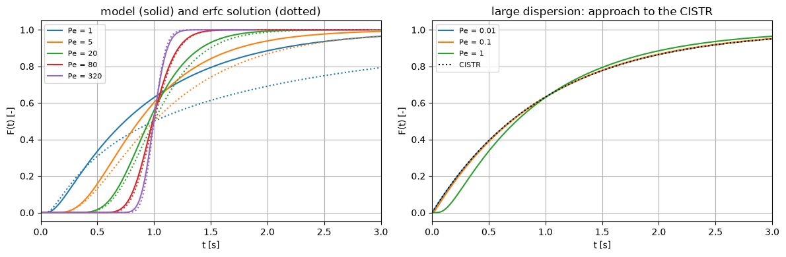

:::{admonition} Check: question 3
:class: tip
- The mean residence time $\int_0^\infty (1-F)\,\mathrm{d}t$ must equal $L/u$ for every Pe.
- The variance should follow the closed-vessel result: close to $2/\mathrm{Pe}$ (in units of $\tau^2$) at large Pe and tending to 1 (CISTR) as Pe goes to 0.
- The erfc solution fits well at large Pe (deviation about 0.06 at Pe = 20) and worse as Pe decreases; at small Pe your curve must approach the CISTR curve.
- Upwinding and backward Euler act like extra axial dispersion. At Pe of a few hundred a coarse grid or large time step gives a stable but far too wide $F$; refine until the variance stops changing.
:::

:::{admonition} Check: question 4
:class: tip
- Without exchange the mean residence time is the moving hold-up times $L/u$; with any exchange it becomes the total liquid hold-up times $L/u$.
- Slow exchange gives early breakthrough plus a long tail; fast exchange must approach a single dispersed phase with the total hold-up.
- The variance should grow without bound as the exchange coefficient goes to zero (at fixed total hold-up), and fall towards the single-phase value as it grows.
:::

:::{admonition} Check: question 5
:class: tip
- For any exchange coefficient the mean residence time must equal total hold-up divided by total flow.
- Without exchange $F$ first rises to the flow share of the fast phase, then follows the slow phase; for fast exchange it must approach one phase with the summed hold-up, velocity and dispersion.
- Pitfall: the RTD is the total outlet flux over the total feed flux, not the outlet concentration of any single phase.
:::

## The Westerterp Wave-Model for Axial Dispersion in Packed Beds

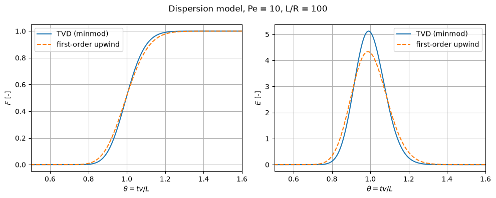

:::{admonition} Check: question 1
:class: tip
- In dimensionless form the only group is $1/Bo = D_{ax}/(vL)$; for $Pe = 10$, $L/R = 100$ it is about 0.0031.
- The mean of $E(\theta)$ must be 1, and the variance must match the closed-vessel formula (about 0.0061 in this case) once the grid is fine enough.
- Pitfall: first-order upwinding adds a numerical dispersion of about $\Delta\zeta/2$, which is comparable to $1/Bo$ here; on 400 plain upwind cells the variance is tens of percent too large. Use a limiter or a much finer grid.
- Mind the outward-normal sign of the dispersive term in the Danckwerts inlet condition.
:::

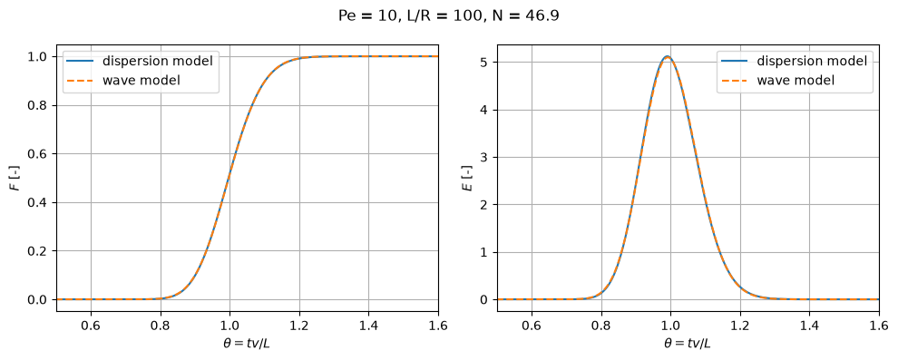

:::{admonition} Check: question 2
:class: tip
- Consistency of the given coefficients: $\varepsilon_1 + \varepsilon_2 = 1$ and $\varepsilon_1 v_1 + \varepsilon_2 v_2 = v$, so the mean residence time must again be $L/v$ (to about six digits with the rounded values).
- In the long-tube limit the two-phase model must reproduce the Taylor-Aris coefficient $v^2R^2/(48D)$; you can check this from the coefficients alone.
- For $Pe = 10$, $L/R = 100$ the two models should give nearly identical RTDs (variances within a fraction of a percent).
- Feed each phase in proportion to its flow $\varepsilon_i v_i$ and read the outlet as the flow-weighted face value.
:::

:::{admonition} Check: question 3
:class: tip
- Organise the results with $1/Bo$ and the exchange number $N = (L/R)/(0.2131\,Pe)$, the number of exchange times per residence time.
- For $N$ well above 1 the two models agree (variance ratio within about 1 %); for short tubes at large Pe they should differ clearly.
- At fixed $L/R$, $1/Bo$ has a minimum at $Pe = \sqrt{48} \approx 7$.
- A good discussion looks at the earliest time tracer reaches the outlet in each model and relates it to the phase velocities $v_1$ and $v_2$.
:::

## Modeling a Desiccant Dryer

:::{admonition} Check: question 1
:class: tip
- Equilibrium loadings: about 0.16 kg/kg for the humid feed and about 0.012 kg/kg for the regeneration air.
- The humidity and temperature fronts move far slower than the gas ($v/\varepsilon$); base the Courant number on the characteristic speeds of the coupled system. With 60 cells and $\Delta t = 0.05$ s it stays below 1, but only just in the hot regeneration air.
- Pitfall: $w_g \sim 10^{-2}$ and $T \sim 3\cdot10^{2}$ K; an absolute Newton tolerance on unscaled unknowns is meaningless for $w_g$. Use a relative criterion or scale the unknowns.
- The accumulation Jacobian is block diagonal with one $2\times2$ block per cell.
:::

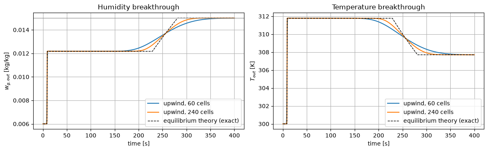

:::{admonition} Check: question 2
:class: tip
- Starting from a bed at $w_g = 0.006$ and 300 K (an assumed initial state), a fast thermal front reaches the outlet after roughly 10 s; the outlet humidity then jumps to a plateau of about 0.012 at a temperature a little above 310 K.
- The humidity breakthrough to the feed value is gradual and happens roughly between 230 and 280 s.
- Water and enthalpy balances, closed with the face fluxes, must hold to round-off; the total water uptake should equal the equilibrium capacity, about 1.4 kg per m$^2$ of cross-section.
- Grid convergence is slow with first-order upwinding; expect smeared fronts on 60 cells.
:::

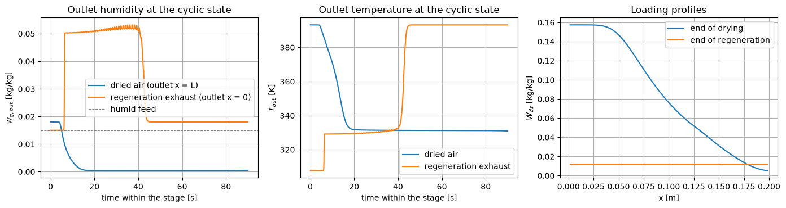

:::{admonition} Check: question 3
:class: tip
- For regeneration the flow is reversed: negative velocity, inlet condition at $x = L$.
- The cyclic state is reached within one or two cycles; check this by comparing the bed state at the end of successive cycles.
- At the cyclic state the mean humidity of the dried air is about 0.0019 kg/kg, so close to 90 % of the feed water is removed.
- Over one cycle, water removed from the process air must equal water released to the regeneration air, and the net enthalpy stored must be zero.
:::

## Axial Convection with Radial Dispersion

:::{admonition} Check: question 1
:class: tip
- Your condition must follow from the angular symmetry of the problem and from the fact that no finite flux can leave a line of zero volume.
- Implementation check: in the cylindrical finite-volume divergence the face at $r = 0$ has zero area. Ask yourself what that means for the flux through it.
- Pitfall: pymrm boundary dictionaries use the outward normal, which points in the $-r$ direction at the axis.
:::

:::{admonition} Check: question 2
:class: tip
- You should end up with a linear system $\mathrm{d}\mathbf{c}/\mathrm{d}x = \mathbf{A}\mathbf{c} + \mathbf{b}$ with a sparse, tridiagonal $\mathbf{A}$.
- Sanity check: the least negative eigenvalue of $\mathbf{A}$, multiplied by $vR^2/D_{rad}$, should approach $-\lambda_1^2 \approx -5.78$ on refinement, with $\lambda_1 = 2.405$ the first zero of $J_0$.
- Expect a very large ratio between the fastest and the slowest eigenvalue: the system is stiff.
:::

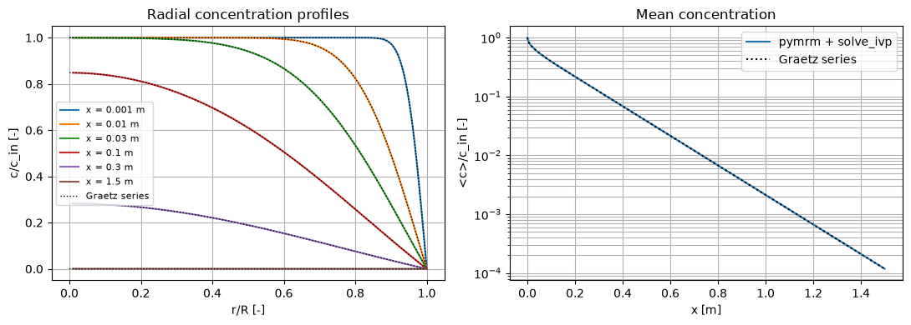

:::{admonition} Check: question 3
:class: tip
- Use a stiff (implicit) method and give it the constant matrix as the Jacobian; an explicit method needs a huge number of steps.
- Near the inlet only a thin layer at the wall is depleted; far downstream the radial profile takes the shape of $J_0(\lambda_1 r/R)$.
- In the fully developed region $\langle c\rangle$ decays as $e^{-5.8\,\xi}$ with $\xi = D_{rad}x/(vR^2)$; at $\xi = 1.5$ about $1.2\times10^{-4}\,c_{in}$ is left.
:::

:::{admonition} Check: question 4
:class: tip
- Take the gradient at the wall face (for example with `compute_boundary_values`), not a difference between the last cell centre and the wall value.
- Balance check: $v\,\mathrm{d}\langle c\rangle/\mathrm{d}x = -2N_w/R$ must close to round-off.
- Close to the inlet $N_w$ should lie within a few % of the penetration result $c_{in}\sqrt{D_{rad}v/(\pi x)}$ (falling as $x^{-1/2}$); downstream it decays exponentially.
:::

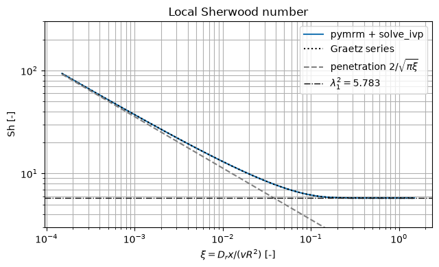

:::{admonition} Check: question 5
:class: tip
- Sh starts high near the inlet and levels off to a constant for $\xi \gtrsim 0.3$; for plug flow that plateau is $\lambda_1^2 \approx 5.78$.
- At small $\xi$, Sh should be a few % above the penetration estimate $2/\sqrt{\pi\xi}$.
- Base Sh on the mean concentration and the wall face flux. Do not compare with the laminar-flow value 3.66, which belongs to a parabolic velocity profile.
- Halving the radial cell size should reduce the error in Sh by about a factor four.
:::

## Diffusion-Reaction in a Cylindrical Pore

:::{admonition} Check: question 1
:class: tip
- An infinitely fast wall reaction is not a volumetric term: check that your PDE has no reaction term and that the reaction enters elsewhere.
- Your equation must contain the cylindrical radial operator $\frac{1}{r}\partial_r(r\,\partial_r c)$ as well as axial diffusion.
- Compare the diffusion time $L^2/D$ (of the order of microseconds) with any process time scale to decide whether you need the time derivative.
:::

:::{admonition} Check: question 2
:class: tip
- You need one condition on each of the four edges: pore mouth, dead end, axis and wall.
- The wall condition should follow from a surface flux balance with rate constant $k_s$ in the limit $k_s \to \infty$.
- Pitfall: pymrm uses the outward normal, so the sign of a gradient term differs between the lower and upper boundary.
- Notice the corner where the mouth meets the wall: the two conditions there are incompatible. Think about what that means for the gradient.
:::

:::{admonition} Check: question 3
:class: tip
- The matrix should have at most five nonzeros per row (a five-point stencil).
- Only the mouth condition should give a nonzero constant vector $\mathbf{b}$ (the wall value is zero).
- Implementation check: your 2D matrix should equal the Kronecker combination of the 1D axial and radial operators to round-off.
:::

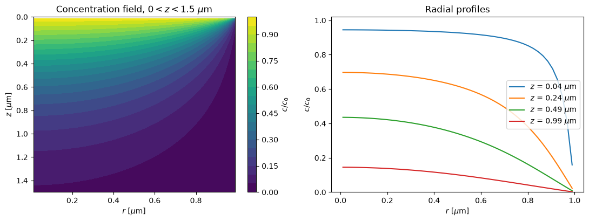

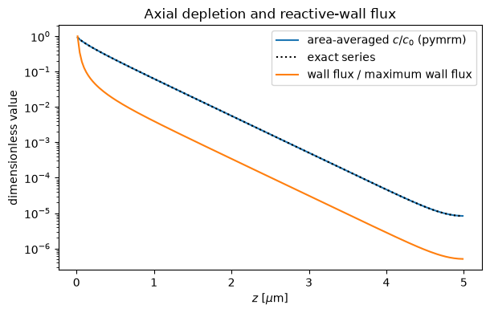

:::{admonition} Check: question 4
:class: tip
- The mean concentration in the pore is about $0.065\,c_0$; the area-averaged concentration at $z = L/2$ is of the order of $10^{-3}\,c_0$.
- Beyond the entrance region the area-averaged concentration decays exponentially with a decay length of about $R/\lambda_1 \approx 0.42~\mu\mathrm{m}$.
- Balance check with face values: the uptake through the mouth equals the consumption at the wall to round-off, and the flux through the dead end is zero.
- Pitfall: if the total uptake at the mouth keeps growing by a similar amount at each grid halving, relate this to the corner of question 2, and use quantities inside the pore for your refinement study.
:::

## 2D Membrane Fixed Bed Reactor Model

:::{admonition} Check: question 1
:class: tip
- The equilibrium conversion is about 0.50.
- It should depend only on $K = k_f/k_b$, not on the inlet concentration.
- Sanity check: the net rate evaluated at your equilibrium composition must be zero.
:::

:::{admonition} Check: question 2
:class: tip
- Without axial dispersion each balance is first order in $z$: an inlet condition only, no outlet condition.
- Only $C$ gets a mixed (Robin) wall condition; the other species have a zero-flux wall. With the outward normal ($+r$ at the wall) the dispersive flux and the membrane flux must have the same sign.
- Limits your equations must reduce to: for $k_m = 0$ ordinary plug flow with flat profiles; for very large $D_{e,r}$ a 1D plug-flow model with a wall sink proportional to $2k_m/R$.
- A good answer identifies a Biot number $k_m R/D_{e,r}$ comparing membrane and radial dispersion resistances.
:::

:::{admonition} Check: question 3
:class: tip
- With $k_m = 0$ the profiles must stay radially flat to round-off and the conversion along $z$ must follow the analytical plug-flow solution for this reversible reaction.
- Balance check: the amount of $C$ that permeated (integrated from the wall face value) must equal $\langle c_D\rangle - \langle c_C\rangle$ at the outlet.
- Pitfall: take wall concentrations at the face, not in the last cell, and give the stiff integrator a sparse Jacobian.
:::

:::{admonition} Check: question 4
:class: tip
- The outlet conversion should be about 0.50, with all four outlet concentrations close to $5~\mathrm{mol\,m^{-3}}$.
- Equilibrium is practically reached about halfway down the tube; the radial profiles stay flat.
:::

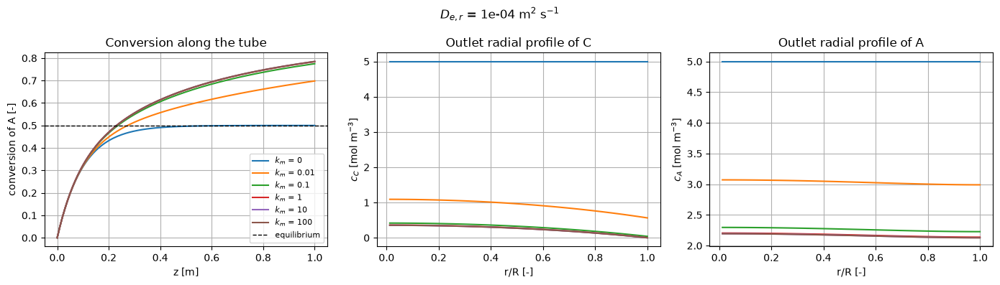

:::{admonition} Check: question 5
:class: tip
- The conversion rises above equilibrium with $k_m$: about 0.70 at $k_m = 0.01~\mathrm{m\,s^{-1}}$, and it saturates near 0.78 to 0.79 from $k_m \approx 1~\mathrm{m\,s^{-1}}$ on.
- Upper bound: even a perfect sink for $C$ cannot beat irreversible second-order plug flow, $Da/(1+Da) \approx 0.83$ with $Da = k_f c_{A,in}L/U_0$.
- Explaining the saturation involves two resistances in series and the Biot number; describe how the wall value of $c_C$ changes with $k_m$.
- For the validity at $k_m = 100~\mathrm{m\,s^{-1}}$, test the model assumptions (constant velocity, one constant $D_{e,r}$ up to the wall) against how much gas you find leaving through the membrane.
:::

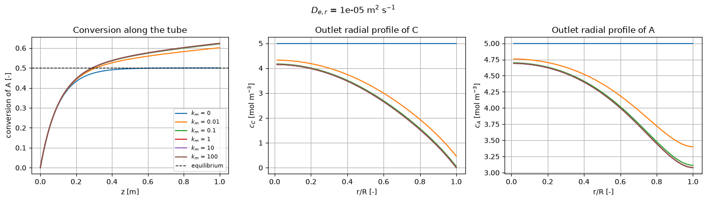

:::{admonition} Check: question 6
:class: tip
- The conversion now saturates around 0.62, so the gain above equilibrium is less than half of that in question 5.
- The core should stay close to equilibrium while $C$ is removed mainly from the outer part of the tube.
- A good discussion compares the radial dispersion distance $\sqrt{D_{e,r}L/U_0}$ with the tube radius and says which part of the system limits the conversion.
:::

## Steady-state 2D fixed bed reactor model: first order exothermal reaction

:::{admonition} Check: question 1
:class: tip
- You should have $2n_r$ coupled ODEs in $z$; the system is stiff, so use an implicit integrator with a (sparse) Jacobian and set absolute tolerances per variable, since $c_A$ and $T$ have very different scales.
- Energy balance with the wall face flux: heat released = sensible heat leaving with the gas + heat conducted to the wall, to within quadrature error.
- Limiting case: with an adiabatic wall the 2D model must reproduce the 1D adiabatic model in every radial cell.
:::

:::{admonition} Check: question 2
:class: tip
- $\Delta T_{ad} = 150~\mathrm{K}$, so $T = 443~\mathrm{K}$ in the adiabatic limit; $c_{A,in} = P/(RT_{in}) \approx 41~\mathrm{mol\,m^{-3}}$.
- Check that $\sum_i \nu_i C_{p,i}$ and the total heat capacity per unit volume behave as you assume; the result should not depend on how far the reaction has proceeded.
:::

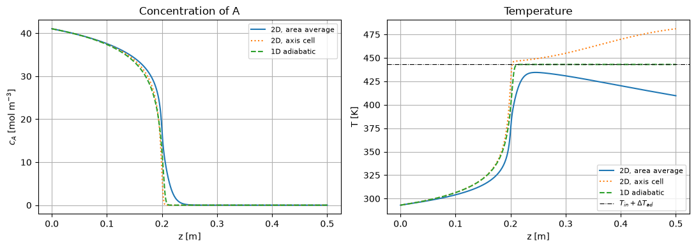

:::{admonition} Check: question 3
:class: tip
- The averaged conversion still shows an S-shaped ignition, reaching 0.5 at about $z = 0.20~\mathrm{m}$, slightly later than in the 1D model; conversion is complete at the outlet.
- The average temperature peaks below 443 K (in the 430 to 435 K range) and then falls to about 410 K at the outlet.
- Pitfall: the area average equals the flow average only because $v$ and $\rho C_p$ are uniform; justify it in your own model.
:::

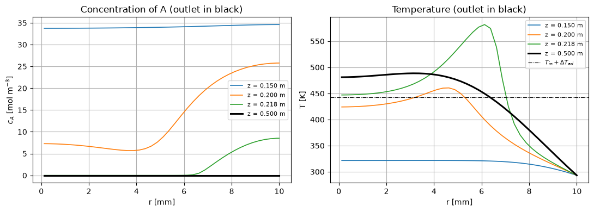

:::{admonition} Check: question 4
:class: tip
- The exit concentration profile is flat at essentially zero, but the exit temperature profile is not flat and not monotonic: its maximum lies off the axis and it drops to $T_w$ at the wall.
- The hot spot is about 580 K, off the axis, around $z \approx 0.22~\mathrm{m}$. It is a sharp peak, so expect it to move by a fraction of a kelvin on refinement.
- A good explanation compares the radial time scales of mass dispersion ($R^2/D_{e,r}$) and heat conduction ($\rho C_p R^2/\lambda_{e,r}$) with each other and with the residence time.
- Test your explanation: with $D_{e,r}$ set equal to $\lambda_{e,r}/(\rho C_p)$ the maximum temperature must not exceed 443 K.
:::

## A 2D Gas-Solid Fluidized Bed

:::{admonition} Check: question 1
:class: tip
- Only the bubble phase is convected; the cloud and emulsion balances are algebraic at every point and need no boundary conditions.
- The bubble balance needs an inlet condition, a symmetry condition at the axis and a zero-flux wall, and no outlet condition.
- Limit check: for species $A$ alone your equations must reproduce the classical Kunii-Levenspiel overall rate constant $K_f$.
- Summed over $A$, $B$ and $C$, the phase exchange and reactions must conserve moles.
:::

:::{admonition} Check: question 2
:class: tip
- The species balances must close to round-off when you use the axial face fluxes.
- The inlet molar flow of $A$ should be close to $\pi R^2\langle U_0\rangle c_{A,in} \approx 7.9~\mathrm{mol\,s^{-1}}$.
- Pitfall: do not impose an outlet condition that the first-order model does not have; with upwinding the outlet face takes the value of the last cell.
:::

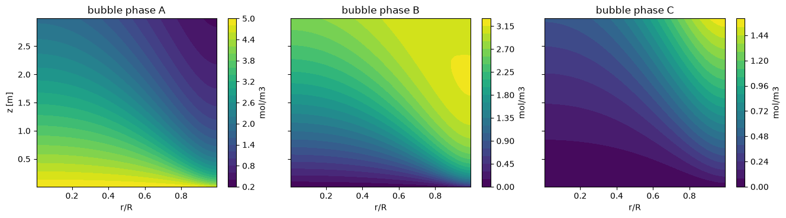
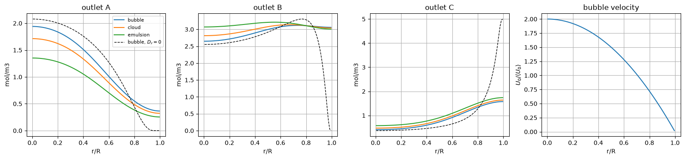

:::{admonition} Check: question 3
:class: tip
- Outlet $c_A$ falls from about 1.9 on the axis to about 0.4 mol/m3 at the wall, and $c_C$ rises from about 0.4 to 1.6 mol/m3.
- $c_B$ has a flat maximum of about 3.1 mol/m3 off the axis, around $r/R \approx 0.7$.
- A good explanation uses the local residence time $L/U_0(r)$ and compares the radial dispersion distance with the radius; also compare with a run without dispersion.
- The emulsion, which holds most catalyst, should be depleted in $A$ and enriched in products relative to the bubble.
:::

:::{admonition} Check: question 4
:class: tip
- $X_A$ is about 0.77 and $S_B$ about 0.77.
- Pitfall: weight the outlet concentrations with the local velocity (cup mixing); a plain area average is wrong for a parabolic profile.
- With first-order upwind in $z$ the error should roughly halve with each doubling of $n_z$; on the prescribed grid it is of the order of $10^{-3}$ in $X_A$.
:::

:::{admonition} Check: question 5
:class: tip
- $X_A$ is about 0.83 and $S_B$ about 0.79, both higher than in question 4.
- The first-order decay constant of $A$ must equal $K_f \approx 0.29~\mathrm{s^{-1}}$.
- Check: the ODE result must match the closed-form solution of a consecutive first-order reaction, and your 2D code with a uniform velocity must converge to it.
:::

## A 2D Bubble Column Model

:::{admonition} Check: question 1
:class: tip
- $\langle\varepsilon_G\rangle = 0.13$ and $\langle\varepsilon_L\rangle = 0.87$ (use the area-weighted average with weight $r$).
- $v_{L,0}$ is about 0.37 m/s and $\Delta v_{GL}$ about 0.71 m/s.
- Check by quadrature that your profiles return $U_L = 1~\mathrm{cm\,s^{-1}}$ and $U_G = 10~\mathrm{cm\,s^{-1}}$; the liquid moves down near the wall, the gas rises at every radius.
:::

:::{admonition} Check: question 2
:class: tip
- An inert tracer fed at $c = 1$ in both phases must stay at $c = 1$ everywhere, and outflow must equal inflow.
- Where the axial flux profile changes (end zones), a radial flux from continuity is needed; without it these cells act as sources or sinks and the tracer test fails.
- Use a flux (Danckwerts) inlet condition; with large end-zone dispersion a fixed inlet value lets extra material diffuse in.
- Limit check: with radially uniform profiles and no end zones you must recover the 1D axial dispersion (Wehner-Wilhelm) conversion.
:::

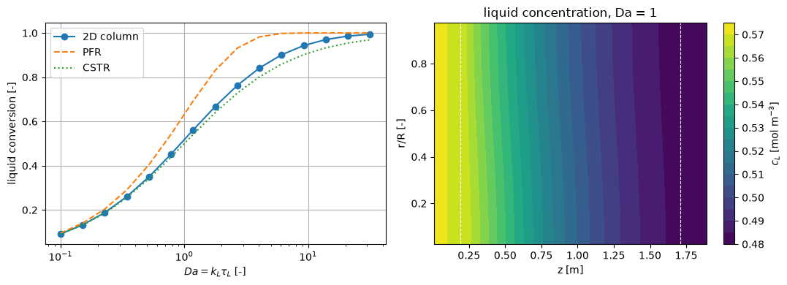

:::{admonition} Check: question 3
:class: tip
- The liquid conversion is close to the ideal CSTR and slightly above it: about 0.52 at $Da = 1$, with $\tau_L = \langle\varepsilon_L\rangle H/U_L$ of about 170 s.
- Increasing the end-zone dispersion further should hardly change the result.
- A good answer relates the behaviour to an axial Péclet number of the liquid and to the internal circulation.
:::

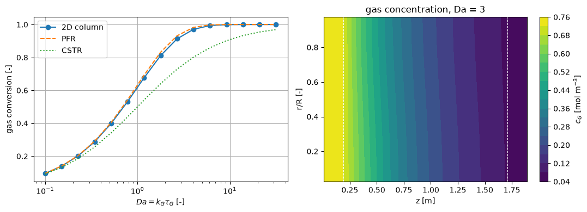

:::{admonition} Check: question 4
:class: tip
- The gas conversion is close to the ideal PFR and slightly below it: about 0.62 at $Da = 1$, with $\tau_G$ of about 2.5 s.
- The deficit below the PFR is largest at intermediate to high conversion and small at very high $Da$.
- A good answer splits the deficit into contributions (axial dispersion, mixed end zones, radial profiles) and compares the radial mixing time with the gas space time.
:::

:::{admonition} Check: question 5
:class: tip
- Open question, so no target values. Check that the uptake per column volume never exceeds $k_La\,c_L^{\ast}$, the transfer rate at zero dissolved concentration.
- With a nonlinear rate, scale the unknowns so that the Newton tolerance is meaningful, and confirm convergence with the residual.
- The balance over both phases (gas absorbed = liquid consumed + liquid outflow) must close.
- For oxygen in water with air, a saturation concentration of about 8 mg/L is a useful sanity check of your Henry coefficient.
:::

## Taylor Dispersion

:::{admonition} Check: question 1
:class: tip
- Write the model in dimensionless form: the RTD should depend only on $Pe = \bar{v}R/D_m$ and $L/R$, or equivalently on $\kappa = D_mL/(\bar{v}R^2)$.
- Check that the discrete volumetric flow $\sum_j a_j u_j$ equals the mean velocity exactly, and that a constant feed gives $c = c_{in}$ everywhere at steady state.
- Pitfall: first-order upwinding adds numerical axial dispersion of about $u\Delta z/2$, which can be as large as the physical spreading in a long tube. Refine or use a TVD scheme.
:::

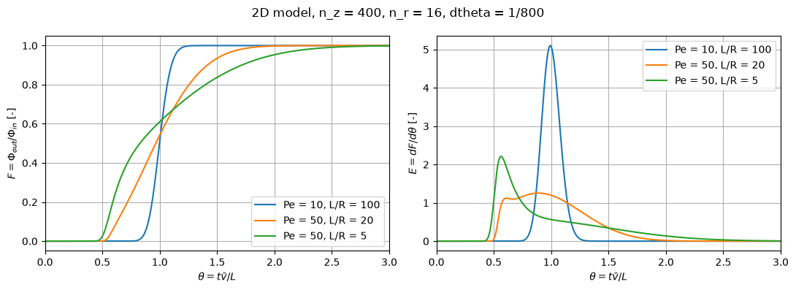

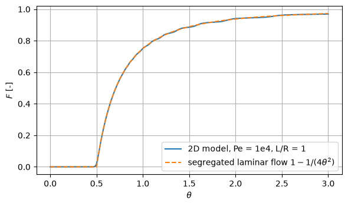

:::{admonition} Check: question 2
:class: tip
- Weight the outlet concentration with the local velocity (molar flow), not with area; $F$ must rise monotonically from 0 to 1.
- For a closed vessel the mean residence time $\int_0^\infty(1-F)\,\mathrm{d}\theta$ must equal the space time.
- Limit check: with negligible radial diffusion you must recover the laminar-flow RTD $F = 1 - 1/(4\theta^2)$ for $\theta \ge 1/2$, with $F = 0$ before $\theta = 1/2$.
- For large $\kappa$ the RTD is a narrow S-curve around $\theta = 1$; for small $\kappa$ tracer arrives first at about $\theta = 0.5$ and a long tail follows.
:::

:::{admonition} Check: question 3
:class: tip
- Compare the models on the same $Pe$ and $L/R$, using the variance and the time of first arrival, not only the look of the curves.
- Sanity check: in a long tube ($\kappa \gg 1$) all models should give nearly the same variance.
- A good answer relates the quality of each 1D model to $\kappa$, and checks whether a model lets tracer leave before the fastest fluid (velocity $2\bar{v}$) could arrive.
:::

## Ternary Diffusion with Maxwell-Stefan Equations

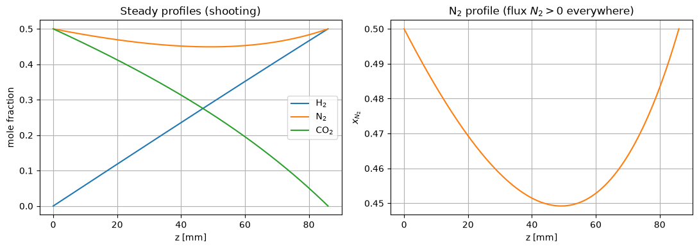

:::{admonition} Check: question 1
:class: tip
- Signs: H$_2$ moves towards bulb A ($N_1 < 0$), CO$_2$ towards bulb B ($N_3 > 0$), and $N_2$ is not zero although $x_2 = 0.5$ at both ends.
- Magnitudes: $N_1$ about $-1.8 \cdot 10^{-2}$, $N_2$ about $8 \cdot 10^{-3}$, $N_3$ about $9 \cdot 10^{-3}~\mathrm{mol\,m^{-2}\,s^{-1}}$, with $c_{tot}$ about $39~\mathrm{mol\,m^{-3}}$.
- The N$_2$ profile is not flat: it passes through a minimum inside the capillary.
- Sanity check: set $D_{23} = D_{13}$; the CO$_2$ flux must then equal the binary Fick result $c_{tot} D_{13} \Delta x_3/\delta$.
:::

:::{admonition} Check: question 2
:class: tip
- The linearized fluxes have the same signs as in question 1; H$_2$ agrees within about 1 %, N$_2$ and CO$_2$ within about 10 %.
- With a constant matrix the profiles are straight lines, so the N$_2$ minimum of question 1 disappears.
- Evaluate the matrix at the arithmetic mean composition of the two ends; in the binary limit $D_{23} = D_{13}$ the CO$_2$ flux must be exact.
:::

:::{admonition} Check: question 3
:class: tip
- Because $N_{tot} = 0$, the Toor-Stewart-Prober fluxes must equal your question 2 fluxes to round-off. A visible difference points to an error in the transformation.
- The two eigenvalues of the Fick matrix $[D]$ are real and positive, of order $10^{-5}$ to $10^{-4}~\mathrm{m^2\,s^{-1}}$.
- Transform both the end compositions and the fluxes with the same eigenvector matrix, and transform back at the end.
:::

:::{admonition} Check: question 4
:class: tip
- Both ends are Dirichlet conditions ($a = 0$, $b = 1$); at the boundary faces use the imposed bulb compositions to evaluate the matrix.
- After convergence the flux must be the same on every face, and the profiles must coincide with the shooting profiles, including the N$_2$ minimum.
- Grid refinement: the fluxes converge with order about 2 towards the shooting fluxes of question 1.
- The flux depends nonlinearly on the compositions, so use Newton with a sparse (block-tridiagonal) Jacobian and check that it converged.
:::

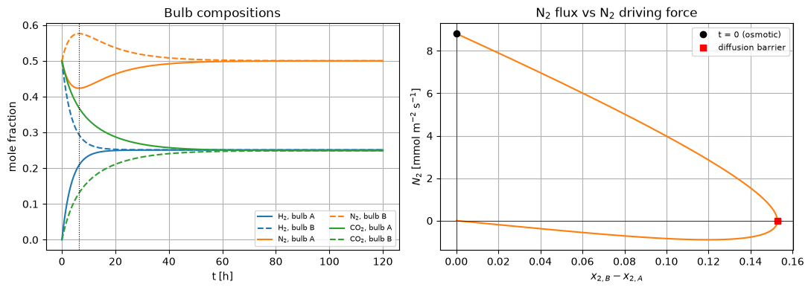

:::{admonition} Check: question 5
:class: tip
- Use $A_d = \pi d^2/4$ with $d = 2.08$ mm. Sign check: bulb A loses what flows in $+z$, bulb B gains it.
- Expected sequence for N$_2$: osmotic diffusion at $t = 0$, then reverse diffusion, then a diffusion barrier ($N_2 = 0$ with unequal bulb compositions) after roughly 6 to 7 h, then normal diffusion.
- Each species is conserved over the two bulbs to round-off, and both bulbs end at the volume-weighted mean composition ($x_1$ about 0.25).
- Pseudo-steady state is justified if the capillary volume is small compared with the bulbs; check this ratio.
:::

## Dehydrogenation of Ethanol

:::{admonition} Check: question 1
:class: tip
- Bootstrap: the fluxes follow the stoichiometry, $N_2 = N_3 = -N_1$, so $N_t \neq 0$. Equimolar counter-diffusion is wrong here.
- The right-hand sides of the three equations must add up to zero, so $\sum_i x_i = 1$ is preserved.
- Limit check: for a binary mixture with a stagnant second species your equations must reduce to Fick's law with the Stefan factor $1/(1 - x_1)$.
- The boundary conditions are the bulk composition at $z = 0$ and the surface reaction $N_1 = k_r c_t x_{1,\delta}$ at $z = \delta$.
:::

:::{admonition} Check: question 2
:class: tip
- $N_1$ about $0.86~\mathrm{mol\,m^{-2}\,s^{-1}}$ towards the catalyst, with $c_t$ about $22~\mathrm{mol\,m^{-3}}$.
- The process is strongly film-limited: $x_{1,\delta}$ is well below 0.1, and acetaldehyde accumulates at the surface.
- Upper bound: $N_1$ must lie between 0 and $k_r c_t x_{1,0}$ (no film resistance), a useful bracket for the root finder.
- Tighten the integration tolerance; the flux should not change in the first few digits.
:::

:::{admonition} Check: question 3
:class: tip
- The exact matrix method solves the same equations as question 2, so the fluxes and surface compositions must agree to the tolerance of your root finder.
- Check your matrix-exponential profile by differentiating it numerically and comparing with the Maxwell-Stefan right-hand side.
- The high-flux correction matrix must tend to the identity when the flux tends to zero; here it differs clearly from the identity.
- Because $k_{13} = k_{23}$, the eigenvalues of $[\Phi]$ coincide; a method based on eigen-decomposition needs care here.
:::

:::{admonition} Check: question 4
:class: tip
- The linearized flux is slightly below the exact one, by less than 1 %.
- Keep the drift terms ($N_t \neq 0$) in the equations; only the composition is replaced by its mean across the film.
- Scale the unknowns (flux and mole fractions) to order one before calling the nonlinear solver.
:::

:::{admonition} Check: question 5
:class: tip
- The reaction conserves mass, so the mass-average velocity is zero in the film; in this frame the diffusion fluxes equal $M_i N_i$.
- Take $M_1 = M_2 + M_3$ exactly, otherwise a small spurious convective mass flux appears.
- The resulting $N_1$ lies within 1 % of the exact value; converting your surface mass fractions back to mole fractions should give values close to those of question 3.
:::

:::{admonition} Check: question 6
:class: tip
- Compare every method against an exact reference (question 2 or 3), and check that reference first against a case with a closed-form answer, for example all $k_{ij}$ equal.
- A good answer relates the errors of the approximate methods to what each one assumes (profile shape, reference frame, composition at which the matrix is evaluated).
- Show that your comparison can fail: solving with the wrong bootstrap (equimolar) must give a much larger error than any of the four methods.
:::

## Mass Transfer Limitations Using Maxwell-Stefan Equations

:::{admonition} Check: question 1
:class: tip
- Compare the largest reaction rate with the largest film transfer rate $k\,a\,c_A$, with $a = 6(1-\varepsilon)/d_p$ (about $1.2 \cdot 10^{3}~\mathrm{m^2\,m^{-3}}$ of bed).
- At the inlet (293 K) this ratio is of order 0.1; evaluate it also at higher temperatures up to the adiabatic limit ($\Delta T_{ad} = 150$ K).
- A good answer relates the conclusion to the activation energy: $k_r$ changes by orders of magnitude along the bed, the film coefficients do not.
:::

:::{admonition} Check: question 2
:class: tip
- Bootstrap from the stoichiometry: $N_B = N_C = -N_A$, so the net flux $N_t = -N_A$ points away from the particle.
- Dilute-$A$ limit: your equation for $A$ must reduce to a Fickian film with $1/k_{eff} = x_B/k_{AB} + x_C/k_{AC}$.
- Binary limit ($k_{AB} = k_{AC}$): you must recover a Stefan-flow law with a factor $(1 + \bar{x}_A)$.
- The film equations must leave the total concentration unchanged across the film, and the rate basis (per gas, solid or bed volume) must be used consistently.
:::

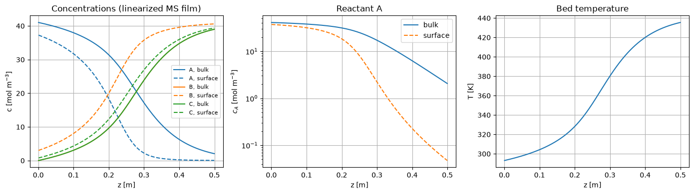

:::{admonition} Check: question 3
:class: tip
- Expected outlet: conversion about 0.95 and temperature about 435 K, somewhat below the adiabatic 443 K; half conversion near $z$ = 0.28 m.
- Near the inlet $c_A^s/c_A^b$ is about 0.9 (kinetic control); near the outlet it is only a few percent (film control).
- At the surface $B$ is enriched more than $C$ although their bulk concentrations are equal.
- Sanity checks: the balance of $A$ with the outlet face value closes to round-off, both approaches give the same outlet conversion, and with first-order upwinding the front position converges with order 1.
:::

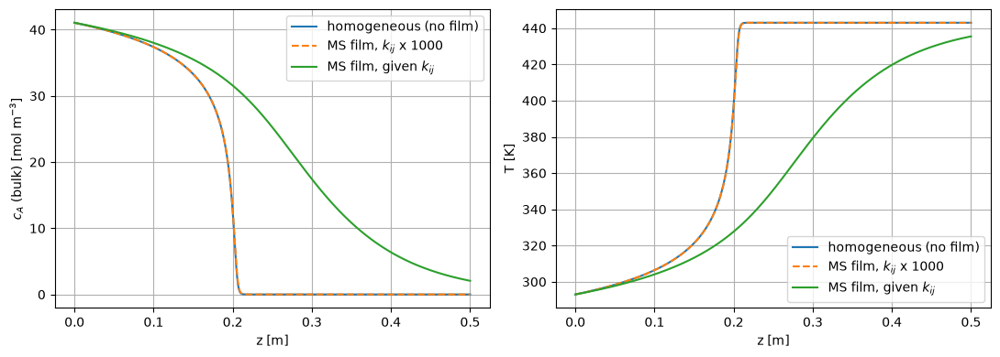

:::{admonition} Check: question 4
:class: tip
- With thousandfold coefficients the profiles must fall on the homogeneous ones, with half conversion near $z$ = 0.19 m as in Exercise 1.3; small differences may remain only in the steep front.
- With the real coefficients the front moves downstream and the outlet conversion is no longer complete.
- A good explanation treats the regions before and after ignition separately and relates each to the external Damköhler number and its temperature dependence.
:::

:::{admonition} Check: question 5
:class: tip
- In the binary limit your exact film must reproduce the exact log law with Stefan flow.
- The exact solution must conserve the total concentration across the film, and agree with a direct numerical integration of the Maxwell-Stefan equations.
- Your linearized relation of question 2 should be close to, but not identical with, the exact one for a test composition.
:::

:::{admonition} Check: question 6
:class: tip
- The exact and linearized films should give nearly the same reactor profiles; conversion differences of order $10^{-4}$, far below 1 %.
- Compare both films without grid error (or on the same grid), so that the discretisation error does not hide the difference.
- A good discussion relates the size of the difference to how large the fluxes are compared with $c_t k_{ij}$.
:::

:::{admonition} Check: question 7
:class: tip
- An effective diffusivity in the particle is not given; state the value you assume, since the results scale with it.
- Check the particle model against the analytical effectiveness factor $\eta = \frac{3}{\phi^2}(\phi\coth\phi - 1)$.
- With a very large $D_{eff}$ ($\eta \to 1$) the combined model must return your question 3 result.
- Adding internal resistance lowers the rate, so ignition moves downstream and the outlet conversion decreases.
:::

## Pressure-Velocity Coupling in a 2D Fixed-Bed Reactor

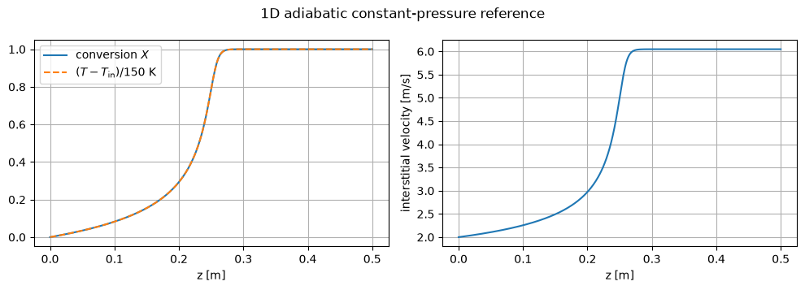

:::{admonition} Check: question 1
:class: tip
- In the adiabatic, constant-pressure reference conversion is complete and $T = 443$ K at the outlet (the adiabatic limit $T_\mathrm{in} + 150$ K for $X = 1$).
- The outlet interstitial velocity is about three times the inlet value, about 6.0 m/s.
- Sanity check: $v_\mathrm{out}/v_\mathrm{in}$ must equal $(1+X)\,T_\mathrm{out}/T_\mathrm{in}$, because the pressure is held constant.
:::

:::{admonition} Check: question 2
:class: tip
- Newton should converge in a handful of iterations, and a different initial guess (cold or adiabatic) should lead to the same state.
- The total molar balance and the enthalpy balance (reaction heat = convected out + removed at the wall) should close to round-off.
- With the solution's parameters ($h = 40$ W/(m$^2$ K)) the outlet conversion is just below 1, the outlet cup temperature is roughly 360 K, and the hot spot lies between 395 and 400 K, on the axis, in the second half of the bed.
- Pitfall: the wall Robin condition uses the outward normal ($+r$); check that heat flows to the wall when $T > T_c$.
:::

:::{admonition} Check: question 3
:class: tip
- With $h = 0$ the 2D model must have no radial profiles and must recover the 1D outlet temperature and outlet velocity.
- The 1D reference has zero pressure drop by construction; compare the 2D pressure drop with a 1D route that also solves Darcy's law. They should agree to within the axial discretisation error (the gap roughly halves when you halve $\Delta z$).
- Expect a pressure drop of order 10 kPa: about 12 kPa adiabatic and about 8 kPa with cooling.
- Trend: wall cooling lowers the outlet temperature, the outlet velocity and the pressure drop.
:::

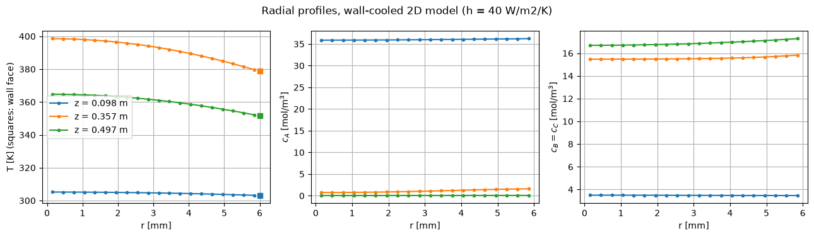

:::{admonition} Check: question 4
:class: tip
- Temperature is highest on the axis and falls towards the cooled wall; the axis-to-wall difference is largest near the hot spot (of order 20 K) and small near the inlet.
- $c_A$ is lowest on the axis at the hot spot; products show the opposite trend.
- Part of the radial variation of every concentration is gas density ($c_t = p/(RT)$), not conversion.
:::

:::{admonition} Check: question 5
:class: tip
- In every cell $\sum_i c_i$ should equal $p/(RT)$ to round-off at convergence. If it does not, your pressure row and species rows are not the same discrete operator, or Newton has not converged.
- The mean outlet superficial velocity should match $(1+X)\,N_\mathrm{in} R T_\mathrm{cup}/p_\mathrm{out}$ to better than 0.1 %.
- The inlet pressure is above 1 bar (about 1.1 bar), so the inlet interstitial velocity is somewhat below 2 m/s.
:::

## Coupled Batch Reactor and Particle Model

:::{admonition} Check: question 1
:class: tip
- Sphere: use the spherical divergence and symmetry at $r = 0$. At $r = R$ the film condition with the outward normal is $D\,\partial c_s/\partial r + k_m c_s = k_m c_f$; print what your boundary dictionary imposes and compare.
- Treat $c_f$ as a time-dependent boundary input and verify that changing it affects the particle model.
- $r_\mathrm{app}$ must be negative while the particles take up reactant. Compute it from the flux through the outer face, not from the last cell centre.
- The exercise gives no numbers: choose them so that both the Thiele modulus and the Biot number $k_m R/D$ are of order 1 to 10, and state them as assumptions.
:::

:::{admonition} Check: question 2
:class: tip
- Steady particle at fixed $c_f$ with first-order kinetics: $r_\mathrm{app}$ must approach $-(1-\varepsilon_b)k_\mathrm{ov}c_f$ with $1/k_\mathrm{ov} = 1/(\eta k) + R/(3k_m)$. The error should drop by about a factor 4 per doubling of the radial grid.
- Without reaction, the uptake at fixed $c_f$ must follow the classical series for a sphere with a surface resistance (Crank); with backward Euler the error should halve when you halve $\Delta t$.
- The reactor alone with a prescribed first-order rate must give an exponential decay, and its discrete balance must close to round-off.
- Make sure your checks can fail: flip the sign of $a$ in the film condition and see that the check notices.
:::

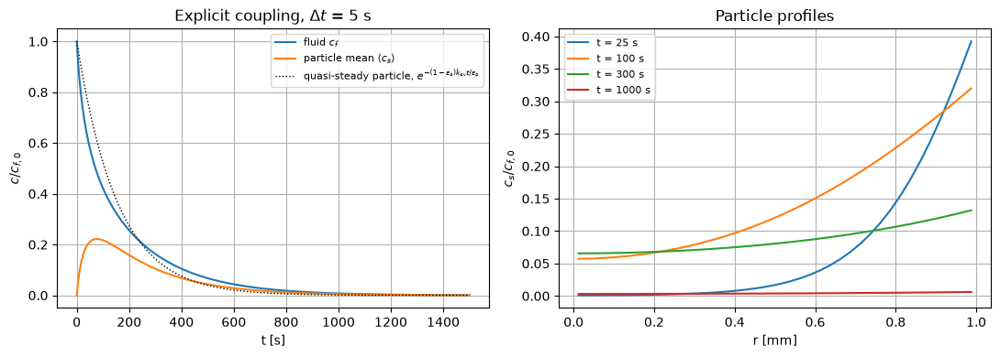

:::{admonition} Check: question 3
:class: tip
- Within a step: particle first with $c_f$ of the old time level, then the reactor with the rate the particle returned, held constant.
- With the reference's assumed parameters ($R = 1$ mm, $D = 10^{-9}$ m$^2$/s, $k = 9\times10^{-3}$ s$^{-1}$, $k_m = 5\times10^{-6}$ m/s, $\varepsilon_b = 0.4$, fresh particles with $c_s = 0$ at $t = 0$) the fluid concentration is about 0.17 of its initial value after 300 s.
- Fresh particles first load up: $\langle c_s\rangle$ passes through a maximum within the first minutes and then decays together with $c_f$.
- A particle treated as quasi-steady misses this initial uptake; compare with it to see whether the particle transient matters for your parameters.
:::

:::{admonition} Check: question 4
:class: tip
- Fluid plus particles plus the amount reacted must stay constant to round-off. If not, the rate you hand to the reactor is not the flux the particle received.
- The splitting error is first order: halving $\Delta t$ should roughly halve the difference with a reference.
- For first-order kinetics the coupled problem is linear, so a Laplace transform in time gives an independent semi-analytical reference for $c_f(t)$.
- Expect the lagged $c_f$ to deplete the fluid slightly too fast.
:::

:::{admonition} Check: question 5
:class: tip
- For one batch reactor the Schur complement is a scalar: one factorisation of the particle Jacobian per step is enough.
- With first-order kinetics Newton needs one step plus one to confirm.
- The Schur complement contains the total derivative of $r_\mathrm{app}$ with respect to $c_f$; it is smaller in magnitude than the derivative at fixed particle concentrations.
:::

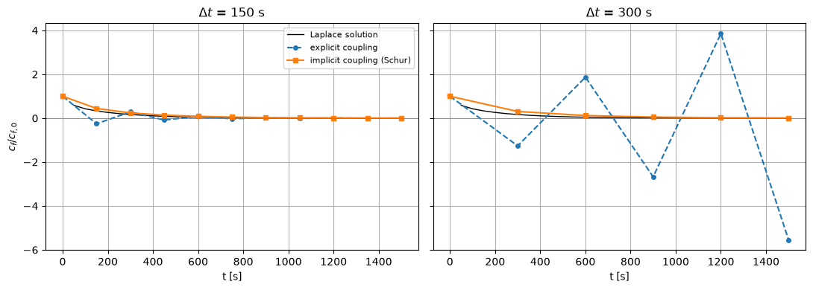

:::{admonition} Check: question 6
:class: tip
- The Schur elimination must agree with a monolithic sparse solve of the same step to round-off.
- At small $\Delta t$ the explicit and implicit results converge to the same limit, with errors of opposite sign.
- With the reference's parameters the explicit coupling gives negative $c_f$ from $\Delta t$ of about 150 s (an oscillating but still decaying mode) and becomes unstable above roughly 230 s, while the implicit coupling stays positive. Find the limit from the spectral radius of your explicit step map.
- A fast-exchange case (fast diffusion, large $k_m$) must approach the pseudo-homogeneous batch reactor, $c_f \approx \varepsilon_b c_{f,0}\,e^{-(1-\varepsilon_b)kt}$ after the initial uptake; the explicit coupling then needs a time step of order seconds or less.
:::

## Reactor-Particle Coupling

:::{admonition} Check: question 1
:class: tip
- The plug-flow outlet must converge to $c_b(L)/c_\mathrm{in} = e^{-\mathrm{Da}}$; with $\mathrm{Da} = 2$ the conversion is about 0.86.
- With first-order upwinding the outlet error should roughly halve when you double $n_z$.
- Pitfall: read the outlet on the outlet face, not in the last cell.
:::

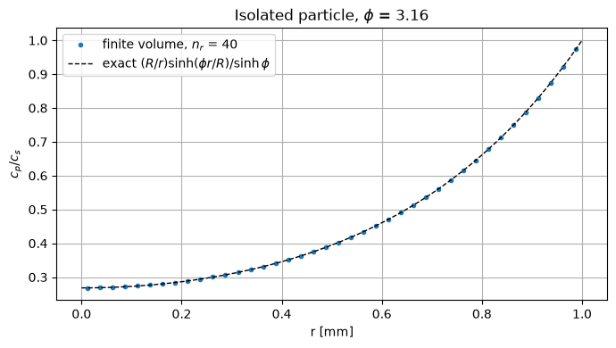

:::{admonition} Check: question 2
:class: tip
- The effectiveness factor from the surface flux must approach $\eta = 3(\phi\coth\phi - 1)/\phi^2$: about 0.94 for $\phi = 1$ and about 0.65 for $\phi \approx 3.2$.
- Use spherical geometry and read the flux on the outer face of the particle; the error should then drop by about a factor 4 per grid doubling.
:::

:::{admonition} Check: question 3
:class: tip
- The explicit iteration should converge (with plug flow it does), in of order ten cycles for $\mathrm{Da} = 2$.
- Check the converged state in the full coupled residual, not only by the change between cycles.
- The outlet should approach $\exp(-\eta\,\mathrm{Da})$; with the parameters above the conversion is about 0.73, clearly below the value without particle resistance.
:::

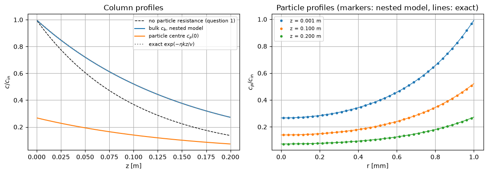

:::{admonition} Check: question 4
:class: tip
- For first-order kinetics the problem is linear: Newton should need one step plus one to confirm.
- The outlet must equal the explicit result to within the stopping tolerance.
- Sanity checks: the nested model equals a column with $\eta k$ from the same particle grid, and $v\,(c_\mathrm{in} - c_b(L))$ equals the integral of $r_\mathrm{app}$ when you use the outlet face value.
:::

:::{admonition} Check: question 5
:class: tip
- Both couplings must give the same conversion; only the cost differs.
- Expect the number of explicit cycles to grow with $\eta\,\mathrm{Da}$, while the implicit iteration count stays constant.
- A good explanation relates the convergence of the explicit scheme to the strength of the particle-column exchange compared with transport, and considers what axial back-mixing does to how a rate error propagates.
:::

## 2D Boundary Surface-Reaction Coupling

:::{admonition} Check: question 1
:class: tip
- An A-atom balance (bulk $c_A + 2c_B$ plus surface $\theta_A + 2\theta_B$, with inlet and outlet face fluxes) should close to round-off in every time step; it tests the sign and weight of the wall coupling.
- Compare your Jacobian with finite differences at a perturbed state.
- Near steady state on the $40 \times 30$ grid the outlet $c_A$ is about 0.17 and the outlet $c_B$ about 0.42; the grid error is a few thousandths.
- Pitfalls: read the outlet on the face, not the last cell; the wall Dirichlet value is an unknown, not a constant.
:::

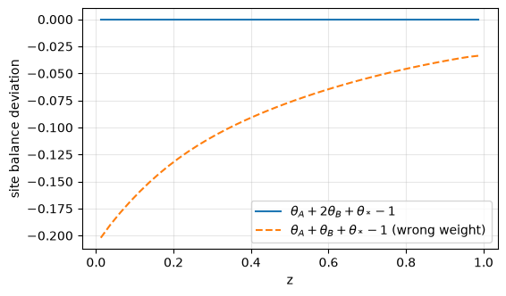

:::{admonition} Check: question 2
:class: tip
- The weighted sum $\theta_A + 2\theta_B + \theta_\ast$ should equal one to round-off in every wall cell at every step.
- The unweighted sum should not: it is off by $-\theta_B$, which shows your check can fail.
- A drift away from one points to rates not all taken at the new time level, or to unconverged Newton steps.
:::

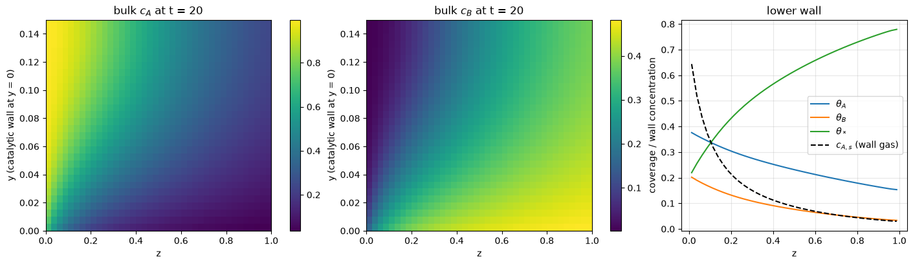

:::{admonition} Check: question 3
:class: tip
- $A$ is depleted in a layer along the catalytic wall that grows downstream; $B$ is highest at the wall.
- Along the wall the vacant fraction increases downstream as the wall gas concentration of $A$ falls: from roughly 0.2 near the inlet to roughly 0.8 near the outlet.
- Independent check: at steady state the coverages must satisfy $r_{ads} = 2 r_{dim} = 2 r_{des}$ in every wall cell.
:::

:::{admonition} Check: question 4
:class: tip
- Doubling $k_{ads}$ lowers the steady outlet $c_A$, but much less than proportionally (by less than a fifth).
- At steady state $c_{B,\mathrm{out}} = (c_{A,\mathrm{in}} - c_{A,\mathrm{out}})/2$, so the change in $B$ must be minus half the change in $A$.
- Repeat on a finer grid to show the change is larger than the discretisation error.
- A good description looks at how the wall concentration of $A$ responds to faster adsorption.
:::

:::{admonition} Check: question 5
:class: tip
- All bulk concentrations and coverages should stay non-negative in every step; the smallest values occur early, where the wall starts empty and the channel starts without $B$.
- If you see negative values, suspect a Newton overshoot or a non-monotone convection scheme.
:::

:::{admonition} Check: boundary versus volumetric source
:class: tip
- A good answer covers where each source enters the discrete equations, at which concentration it is evaluated, and the units (per wall area or per volume, with the specific area $1/H$).
- It considers the extra transport step to the wall; a numerical test in which the transverse diffusion is made very fast is a convincing way to show it.
:::

## Monolithic 2D Membrane Module

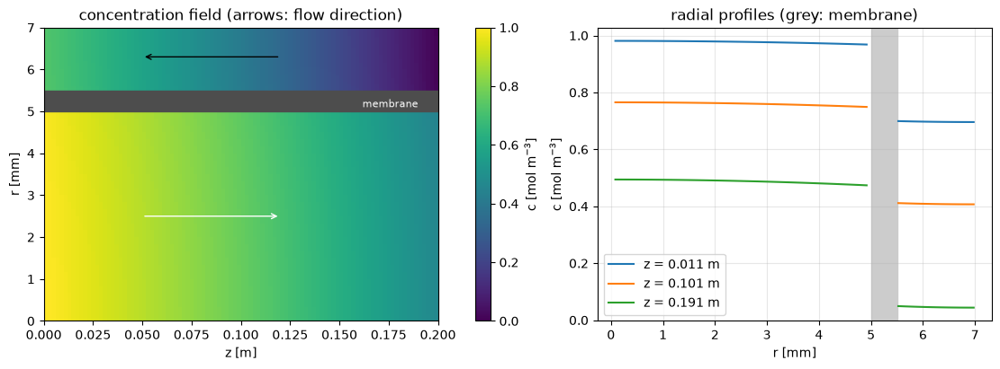

:::{admonition} Check: question 1
:class: tip
- One sparse solve should give a backward error at round-off, and all concentrations should lie between the two feed values.
- The retentate is depleted along $z$, and the counter-current permeate is enriched towards $z = 0$; within each channel the radial profiles are nearly flat, and the large step sits across the membrane.
- The retentate outlet cup-mixing concentration is about 0.46 on the base grid; the axial (upwind) error is below 1 %.
:::

:::{admonition} Check: question 2
:class: tip
- Cup-mixing retentate outlet about 0.46, permeate outlet about 0.73: the permeate leaves richer than the retentate outlet, which only counter-current flow allows.
- Weight with the ring areas $2\pi r\,\Delta r$, not with plain cell averages.
- Pitfall: take outlets on the axial faces; last-cell values differ in the third decimal.
:::

:::{admonition} Check: question 3
:class: tip
- The net axial molar flow (retentate minus permeate) must be the same at every axial face, to round-off.
- Retentate loss, membrane law at the face values, and permeate gain must all agree; a little over half of the retentate feed crosses the membrane in the base case.
- Pitfall: the permeate side needs the area factor $R_\mathrm{perm}/R_\mathrm{ret}$; without it the balance fails by several percent.
:::

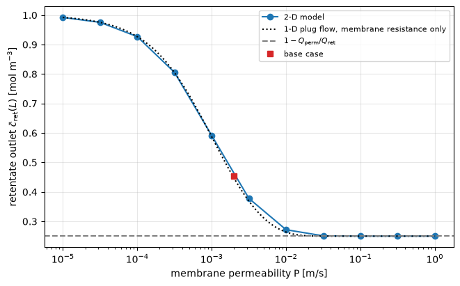

:::{admonition} Check: question 4
:class: tip
- The retentate outlet concentration falls monotonically with $P$, with a steep transition around the base permeability.
- At small $P$ it must match the 1D counter-current exchanger closed form; at large $P$ it saturates at $1 - Q_\mathrm{perm}/Q_\mathrm{ret} = 0.25$.
- The 2D result should never lie below the 1D plug-flow result (radial diffusion only adds resistance).
:::

:::{admonition} Check: question 5
:class: tip
- A good answer shows what happens to a lagged (segregated) interface iteration as $P$ grows, preferably with a numerical test at a small and a large $P$.
- Relate the amplification of an error in the membrane flux to $P$ and the transfer capacity of the streams, and discuss what the membrane condition tends to for $P \to \infty$.
:::

## Reactor-Particle Coupling with Maxwell-Stefan Film Transfer

:::{admonition} Check: question 1
:class: tip
- Newton should converge in a few iterations to a backward error at round-off.
- Reactor mole balances per species should close to round-off when you use the outlet face value; the sum of the film differences $\sum_i (c_{b,i} - c_{g,i})$ should vanish.
- Limit check: with $A$ strongly diluted the model must approach the closed-form Danckwerts result with an overall rate constant (film and effectiveness factor in series).
:::

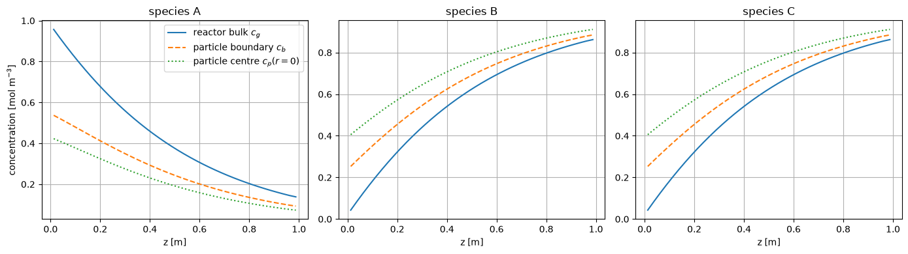
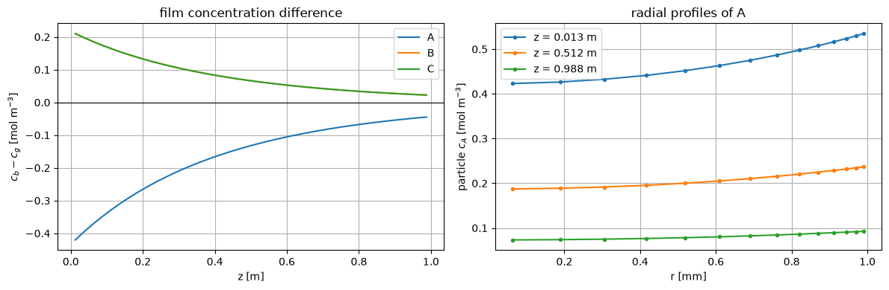

:::{admonition} Check: question 2
:class: tip
- For $A$: bulk > boundary > particle centre; for $B$ and $C$ the order is reversed, and in the base case $B$ and $C$ coincide.
- The film drop of $A$ is largest near the inlet: $c_{b,A}/c_{g,A}$ is about 0.56 there and rises downstream.
- The ratio of centre to boundary concentration of $A$ should be the same at every axial position (about 0.79), because the particle problem is linear.
:::

:::{admonition} Check: question 3
:class: tip
- Outlet conversion about 0.86 on 40 axial cells, based on the outlet face value and $c_{A,\mathrm{in}}$.
- The minimum of the state vector is positive, of order $0.01$ to $0.1$ mol/m$^3$; check which species and region it belongs to, and how it changes when you refine the axial grid.
:::

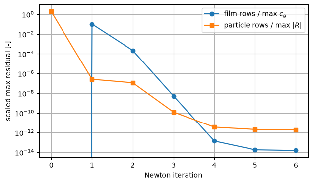

:::{admonition} Check: question 4
:class: tip
- Both residual blocks should be at round-off at convergence and decrease quadratically together during the Newton iterations.
- The blocks have different units (mol/m$^3$ and mol/(m$^3$ s)); compare them after dividing each by a natural scale.
:::

:::{admonition} Check: question 5
:class: tip
- Increasing $\mathcal{D}_{AB}$ raises the outlet conversion, with diminishing returns; the change over a factor 16 in $\mathcal{D}_{AB}$ should be well above the axial discretisation error.
- A good description separates the local effect on $c_{b,A}/c_{g,A}$ from the effect of more upstream conversion on $c_{g,A}$, and looks at more than one axial position.
:::

:::{admonition} Check: Maxwell-Stefan versus Fickian film
:class: tip
- A good explanation involves the net molar flux out of the particle (one mole in, two out) and how the Maxwell-Stefan equations couple the fluxes through the mole fractions.
- Compare with a run using independent Fickian film coefficients; the conversion difference should exceed the grid error.
- Check the total concentration across the film in both models.
:::
